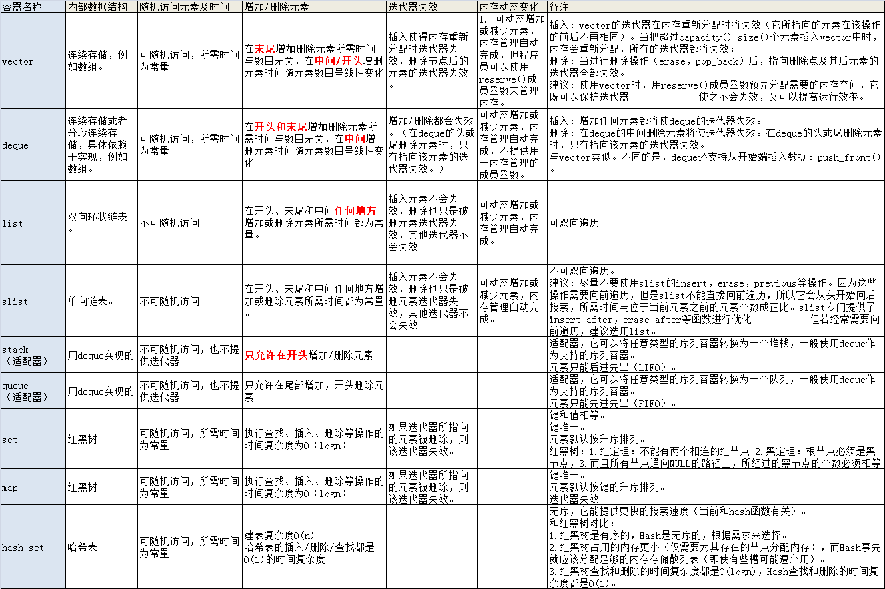

- [基础](#基础)
  - [C和 C++ 的区别](#c和-c-的区别)
    - [在C++程序中调用被C编译器编译后的函数，为什么要加extern“C”](#在c程序中调用被c编译器编译后的函数为什么要加externc)
  - [struct与class的区别](#struct与class的区别)
  - [new/delete与malloc/free的区别](#newdelete与mallocfree的区别)
  - [指针与引用的区别](#指针与引用的区别)
  - [深拷贝与浅拷贝的区别](#深拷贝与浅拷贝的区别)
  - [移动构造函数与拷贝构造函数区别](#移动构造函数与拷贝构造函数区别)
  - [重写与重载区别](#重写与重载区别)
  - [const和define区别](#const和define区别)
  - [内联函数与宏定义区别](#内联函数与宏定义区别)
  - [数组和指针区别](#数组和指针区别)
  - [前置++与后置++的区别](#前置与后置的区别)
  - [源文件从文本到可执行文件经历的过程](#源文件从文本到可执行文件经历的过程)
  - [动态链接库和静态链接库的区别](#动态链接库和静态链接库的区别)
  - [四种类型转换：static_cast、dynamic_cast、const_cast、reinterpret_cast](#四种类型转换static_castdynamic_castconst_castreinterpret_cast)
- [面向对象](#面向对象)
  - [面向对象的三大特性：封装、继承、多态](#面向对象的三大特性封装继承多态)
  - [类的访问权限：public、private、protected](#类的访问权限publicprivateprotected)
  - [虚函数实现动态多态的原理](#虚函数实现动态多态的原理)
  - [虚函数与纯虚函数的区别](#虚函数与纯虚函数的区别)
  - [类的构造函数、析构函数、拷贝函数、赋值函数](#类的构造函数析构函数拷贝函数赋值函数)
  - [动态多态、静态多态](#动态多态静态多态)
- [内存](#内存)
  - [内存布局（全局区、堆区、栈区、常量区、代码区）](#内存布局全局区堆区栈区常量区代码区)
  - [指针、野指针、内存泄露](#指针野指针内存泄露)
  - [如何判断内存泄漏，怎么避免](#如何判断内存泄漏怎么避免)
  - [malloc的原理](#malloc的原理)
- [STL](#stl)
  - [容器的实现原理，如 vector、deque、map、hashmap](#容器的实现原理如-vectordequemaphashmap)
  - [vector与list对比](#vector与list对比)
  - [map与unordered_map对比](#map与unordered_map对比)
  - [set与unordered_set对比](#set与unordered_set对比)
  - [set和map实现原理](#set和map实现原理)
  - [迭代器](#迭代器)
- [C++11新特征](#c11新特征)
  - [右值引用](#右值引用)
  - [智能指针底层实现：auto_ptr、unique_ptr、shared_ptr、weak_ptr](#智能指针底层实现auto_ptrunique_ptrshared_ptrweak_ptr)
  - [shared_ptr中的循环引用](#shared_ptr中的循环引用)
  - [可变参数模板](#可变参数模板)
  - [auto](#auto)
  - [decltype](#decltype)
  - [lambda](#lambda)
- [《More Effective C++》](#more-effective-c)
  - [条款27：如何让类对象只在栈（堆）上分配空间？](#条款27如何让类对象只在栈堆上分配空间)

# 基础

## C和 C++ 的区别

### 在C++程序中调用被C编译器编译后的函数，为什么要加extern“C”
典型的，一个C++程序包含其它语言编写的部分代码。类似的，C++编写的代码片段可能被使用在其它语言编写的代码中。不同语言编写的代码互相调用是困难的，甚至是同一种编写的代码但不同的编译器编译的代码。例如，不同语言和同种语言的不同实现可能会在注册变量保持参数和参数在栈上的布局，这个方面不一样。

为了使它们遵守统一规则，可以使用extern指定一个编译和连接规约。extern "C"的真实目的是实现类C和C++的混合编程。在C++源文件中的语句前面加上extern “C”，表明它按照类C的编译和连接规约来编译和连接，而不是C++的编译的连接规约。extern "C"指令中的C，表示的一种编译和连接规约，而不是一种语言。C表示符合C语言的编译和连接规约的任何语言，如Fortran、assembler等。还有要说明的是，extern "C"指令仅指定编译和连接规约，但不影响语义。例如在函数声明中，指定了extern “C”，仍然要遵守C++的类型检测、参数转换规则。

## struct与class的区别

其实结构体和类没太大不同，都会有构造函数，析构函数，成员变量。它们的区别是结构体中的变量默认作用域是public的，而类中的变量默认作用域是private。

## new/delete与malloc/free的区别

共同之处：

这是一个老生常谈的问题，它们会被摆在一起比较，源于它们都可用于申请动态内存和释放内存。但是malloc是单纯的申请一块内存，而new则是带有面向对象的特性得到的指针是直接带类型信息的。

不同之处：我们可以从以下四个点来进行区分，同时也方便记忆

(1) 函数类型不同

 malloc&free是C++的标准库函数。 
 
 new&delete是C++的运算符，所以说我们可以重载这个函数，也能够实现在new函数中加入我们生成对象时需要执行的构造函数，在回收delete时执行对象的析构函数。而由于malloc/free是库函数而不是运算符，不在编译器控制权限之内，不能够把执行构造函数和析构函数的任务强加于malloc/free。

(2) 返回类型不同

new返回的是指定指针类型，malloc返回的是void*。上文提及，new出来的指针是带有面向对象的特性，是直接带类型信息的，所以我们可以这样子来进行赋值.
```
#include <cstdlib>
class Test
{
    ...
}
Test* pn = new Test;
```

而如果是通过malloc申请的动态内存，则是void*类型，需要我们强制转化为想要的指针类型。

```
#include <cstdlib>
class Test
{
    ...
}
 
Test* pm = (Test*)malloc(sizeof(Test));
```

(3) 请求方式不同

从上面的例子可以看出，new出来的指针不需要显式的说明申请内存块的大小，而malloc是需要显式的声明内存块空间大小的。

(4) 释放方式不同

因为请求方式不一样，所以释放方式也有所不同。malloc我们直接申请一块内存，那么我们就直接free释放掉整块内存就可以了。但是new出来的是一个个对象类型的指针，所以为了能够生成多个对象的指针，就有了new[] 的出现，new[]需要和delete[]搭配使用，delete[]会调用每一个成员的析构函数。

(5) 请求失败结果不同

若因为内存紧张，在堆中申请不到内存，则new会抛出异常，而malloc会返回null值

简单来说，可以把new&delete当作是可以调用构造函数和析构函数的malloc&free，但实际上它们会有着：函数类型，返回类型，请求方式,释放方式以及请求失败结果的不一样。

## 指针与引用的区别

相同点：

1. 都是地址的概念；
2. 都是“指向”一块内存。指针指向一块内存，它的内容是所指内存的地址；而引用则是某块内存的别名(我就是那一块内存，我指我自己)；
3. 引用在内部实现其实是借助指针来实现的，一些场合下引用可以替代指针，比如作为函数形参。

不同点：

1. 指针是一个实体（新增空间地址），而引用仅是个别名（创建多个引用都不会新增地址，因为都是同一地址的别名而已）；
2. 引用只能在定义时被初始化一次，之后不可变；指针可变；引用“从一而终”，指针可以“见异思迁”；
3. 引用不能为空，指针可以为空；
4. “sizeof 引用”得到的是所指向的变量(对象)的大小，而“sizeof 指针”得到的是指针本身的大小；
5. 指针和引用的自增(++)运算意义不一样；
6. 引用是类型安全的，而指针不是 (引用比指针多了类型检查)


## 深拷贝与浅拷贝的区别

## 移动构造函数与拷贝构造函数区别

## 重写与重载区别

重载：是指允许存在多个同名函数，而这些函数的参数不同（或许参数个数不同，或许参数类型不同，或许两者都不同）。目的是简化编程的工作以及提高代码的可读性。

（1）重载：重载翻译自overload，是指同一可访问区内被声明的几个具有不同参数列表（参数的类型，个数，顺序不同）的同名函数，根据参数列表确定调用哪个函数，重载不关心函数返回类型。

（2）重写：重写翻译自override，是指派生类中存在重新定义的函数。其函数名，参数列表，返回值类型，所有都必须同基类中被重写的函数一致，只有函数体不同。

## const和define区别
两者都可以常用于定义常量，所以会被比较。它们有以下三点不同：

数据类型：const 常量有数据类型，而宏常量没有数据类型，编译器可以对前者进行类型安全检查。而对后者只进行字符替换，没有类型安全检查

处理阶段：#define定义的宏变量在预处理时进行替换，const所定义的变量在编译时确定其值

地址访问：#define定义的常量是不可以用指针去指向，const定义的常量可以用指针去指向该常量的地址

目的不同：一般来说我们使用define是想让这个数字变得可读易理解（比如#define MIN 0，#define MAX 100）,而const的目的则是更侧重想让这个数据不被破坏，想让编译器帮我们检测

## 内联函数与宏定义区别
[C++内联函数（C++ inline）详解](http://c.biancheng.net/view/199.html)

## 数组和指针区别

## 前置++与后置++的区别

i++是返回int型的对象本身，此时的temp是记录了自增之前的值，而++i是返回int型对象的引用，引用是对象的别名，所以返回的是自增之后的值。

## 源文件从文本到可执行文件经历的过程

(1) 预处理 (Preprocessing)

预处理相当于根据预处理指令组装新的C/C++程序。经过预处理，会产生一个没有宏定义，没有条件编译指令，没有特殊符号的输出文件，这个文件的含义同原本的文件无异，只是内容上有所不同。

读取C/C++源程序，对其中的伪指令（以#开头的指令）进行处理
- 将所有的“#define”删除，并且展开所有的宏定义
- 处理所有的条件编译指令，如：“#if”、“#ifdef”、“#elif”、“#else”、“endif”等。这些伪指令的引入使得程序员可以通过定义不同的宏来决定编译程序对哪些代码进行处理。预编译程序将根据有关的文件，将那些不必要的代码过滤掉。 
- 处理“#include”预编译指令，将被包含的文件插入到该预编译指令的位置。

（注意：这个过程可能是递归进行的，也就是说被包含的文件可能还包含其他文件）

删除所有的注释

添加行号和文件名标识。

以便于编译时编译器产生调试用的行号信息及用于编译时产生的编译错误或警告时能够显示行号

保留所有的#pragma编译器指令

(2) 编译 (Compilation) 

这里的编译不是指程序从源文件到二进制程序的全部过程，而是指将经过预处理之后的程序转换成特定汇编代码(assembly code)的过程。

将预处理完的文件进行一系列词法分析、语法分析、语义分析及优化后，产生相应的汇编代码文件。

(3) 汇编 (Assemble)

将编译完的汇编代码文件翻译成机器指令，并生成可重定位目标程序的.o文件，该文件为二进制文件，字节编码是机器指令。

汇编器是将汇编代码转变成机器可以执行的指令，每一个汇编语句几乎都对应一条机器指令。所以汇编器的汇编过程相对于编译器来讲比较简单，它没有复杂的语法，也没有语义，也不需要做指令优化，只是根据汇编指令和机器指令的对照表一一翻译即可。

(4) 链接 (Linking)

链接过程将多个目标文件以及所需的库文件链接成最终的可执行文件(executable file)。其中库分为动态链接库以及静态链接库。

## 动态链接库和静态链接库的区别

静态链接（lib）

在这种链接方式下，函数的代码将从其所在地静态链接库中被拷贝到最终的可执行程序中（进入exe文件）。这样该程序在被执行时这些代码将被装入到该进程的虚拟地址空间中。静态链接库实际上是一个目标文件的集合，其中的每个文件含有库中的一个或者一组相关函数的代码。

动态链接 （dll）
在此种方式下，函数的代码被放到称作是动态链接库或共享对象的某个目标文件中。链接程序此时所作的只是在最终的可执行程序中记录下共享对象的名字以及其它少量的登记信息（只记录名称地址）。在此可执行文件被执行时，动态链接库的全部内容将被映射到运行时相应进程的虚地址空间。动态链接程序将根据可执行程序中记录的信息找到相应的函数代码。

C/C++编译过程对于可执行文件中的函数调用，可分别采用动态链接或静态链接的方法。使用动态链接能够使最终的可执行文件比较短小，并且当共享对象被多个进程使用时能节约一些内存，因为在内存中只需要保存一份此共享对象的代码。但并不是使用动态链接就一定比使用静态链接要优越。在某些情况下动态链接可能带来一些性能上损害。

## 四种类型转换：static_cast、dynamic_cast、const_cast、reinterpret_cast

[强制转换](https://www.cnblogs.com/chenyangchun/p/6795923.html)


# 面向对象

## 面向对象的三大特性：封装、继承、多态

## 类的访问权限：public、private、protected

## 虚函数实现动态多态的原理

这个技术的核心是虚函数表，类的对象内部会有指向类内部的虚表地址的指针（__vptr字段记录）。通过这个指针调用虚函数。虚表是属于类的，而不是属于某个具体的对象，一个类只需要一个虚表即可。同一个类的所有对象都使用同一个虚表。

## 虚函数与纯虚函数的区别

加上一个virtual的关键字，这样的话，若子类没有重写这个方法，那么就会调用父类的方法，若子类重写了该方法，那么就会调用子类的方法。

实现纯虚函数(抽象方法)很简单，只要在虚函数的基础上=0就可以了。它的目的是让子类才实现这个方法，而基类就先不定义这个函数体。

而它有以下两个限制：1.纯虚函数子类必须重写，2.含抽象方法的类就是抽象类，而抽象类则不可以实例化。

## 类的构造函数、析构函数、拷贝函数、赋值函数

## 动态多态、静态多态

# 内存

## 内存布局（全局区、堆区、栈区、常量区、代码区）

C/C++程序编译时内存分为5大存储区

（1）栈区（stack）：由编译器自动分配释放，存放函数的参数值，局部变量值等，其操作方法类似数据结构中的栈。
（2）堆区（heap）：一般由程序员分配释放（new，malloc），与数据结构中的堆毫无关系，分配方式类似于链表。
（3）全局/静态区（static）：全局变量和静态变量的存储是放在一起的，在程序编译时分配。
（4）文字常量区：存放常量字符串。
（5）程序代码区：存放函数体（类的成员函数、全局函数）的二进制代码

在全局静态区生成的int默认为0，在堆栈区生成的不会被赋予初始值。

堆和栈的区别

1).堆存放动态分配的对象——即那些在程序运行时动态分配的对象，比如 new 出来的对象（其生存期由程序控制)；
2).栈用来保存定义在函数内的非static对象，如局部变量，仅在其定义的程序块运行时才存在（生命周期同函数）；
3).静态内存用来保存static对象，类static数据成员以及定义在任何函数外部的变量，static对象在使用之前分配，程序结束时销毁（生命周期同程序）；
4).栈和静态内存的对象由编译器自动创建和销毁。堆是需要程序员手动申请和释放；
1) 栈的效率比堆高很多,且不容易产生内存碎片

## 指针、野指针、内存泄露

野指针(wild pointer)就是没有被初始化过的指针。

悬空指针是指针最初指向的内存已经被释放了的一种指针。

无论是野指针还是悬空指针，都是指向无效内存区域(这里的无效指的是"不安全不可控")的指针。 访问"不安全可控"(invalid)的内存区域将导致"Undefined Behavior"。

## 如何判断内存泄漏，怎么避免


## malloc的原理


# STL

## 容器的实现原理，如 vector、deque、map、hashmap


## vector与list对比

vector在内存中是分配一段连续的内存空间进行存储，其迭代器采用原生指针即可，因此其支持随机访问和存储，支持下标操作符，节省空间。但是其在分配的内存不够的情况下，需要对容器整体进行重新分配、拷贝和释放等操作，而且在vector中间插入或删除元素设计元素的移动，效率很低。

而list是以节点形式来存放数据，使用的是非连续的内存空间来存放数据，因此，在其内部插入和删除元素的时间复杂度都是O(1),但是其不支持随机访问和存取，不支持下标，而且比vector占用的内存要多。

## map与unordered_map对比

## set与unordered_set对比

## set和map实现原理

## 迭代器

输入迭代器

输出迭代器

前向迭代器

双向迭代器

随机访问迭代器


额外的迭代器：

插入迭代器

流迭代器

反向迭代器

移动迭代器


# C++11新特征

## 右值引用

右值引用出现之前我们只能用const引用来关联临时对象（右值），所以我们不能修临时对象的内容，右值引用的出现就让我们可以取得临时对象的控制权，终于可以修改临时对象了！
```
int main()
{
    int i = 42;
    int &r = i; // ok: r refers to i
    int &&rr = i;   // error: cannot bind an rvalue reference to an lvalue
    int &r2 = i * 42;   // error: i * 42 is an rvalue
    const int &r3 = i * 42; // ok: we can bind a reference to  const  to an rvalue
    int &&rr2 = i * 42; 
    int &&rr3 = rr2;   // error: the expression rr2 is an lvalue!
    return 0;
}
```
即凡是可以 vartype varname; 这样定义出来的变量（variable）其自身都是左值。

std::move相关。 右值引用因为绑定对象即将被销毁，意味着没有人会继续访问他们，所以就可以把他们（的资源）steal（偷）过来。 虽然不能将右值引用绑在左值上，但通过利用utility头文件新增的函数模板move，它返回传入对象的右值引用，可以达到 steal的效果。
```
int &&rr3 = std::move(rr2); // ok
```
再提醒：一旦使用了move，编译器就默认传入对象已经不打算使用了，是可以被销毁的，move之后该对象的值已经不确定，不要再访问。还有由于对象偷取与复制的差别巨大，不注意会产生非常难定位的bug，所以所有使用move的地方一定要使用全称std::move，给大家以提醒。（其实c++11在algorithm头文件也新增了一个move，参数与意义都与此截然不同）。

## 智能指针底层实现：auto_ptr、unique_ptr、shared_ptr、weak_ptr
## shared_ptr中的循环引用

[C++11中智能指针的原理、使用、实现](https://www.cnblogs.com/wxquare/p/4759020.html)

## 可变参数模板

我们在C++中都用过pair，pair可以使用make_pair构造，构造一个包含两种不同类型的数据的容器。比如，如下代码：
```
auto p = make_pair(1, "C++ 11"); 
```
由于在C++11中引入了变长参数模板，所以发明了新的数据类型：tuple，tuple是一个N元组，可以传入1个， 2个甚至多个不同类型的数据
```
auto t1 = make_tuple(1, 2.0, "C++ 11");  
auto t2 = make_tuple(1, 2.0, "C++ 11", {1, 0, 2}); 
```
这样就避免了从前的pair中嵌套pair的丑陋做法，使得代码更加整洁

另一个经常见到的例子是Print函数，在C语言中printf可以传入多个参数，在C++11中，我们可以用变长参数模板实现更简洁的Print
```
template<typename head, typename... tail>  
void Print(Head head, typename... tail) {  
    cout<< head <<endl;  
    Print(tail...);  
} 
```
Print中可以传入多个不同种类的参数，如下：
```
Print(1, 1.0, "C++11"); 
```

## auto

C++11中引入auto***种作用是为了自动类型推导

auto的自动类型推导，用于从初始化表达式中推断出变量的数据类型。通过auto的自动类型推导，可以大大简化我们的编程工作

auto实际上实在编译时对变量进行了类型推导，所以不会对程序的运行效率造成不良影响

另外，似乎auto并不会影响编译速度，因为编译时本来也要右侧推导然后判断与左侧是否匹配。

## decltype

decltype实际上有点像auto的反函数，auto可以让你声明一个变量，而decltype则可以从一个变量或表达式中得到类型，有实例如下：
```
int x = 3;  
decltype(x) y = x; 
```
有人会问，decltype的实用之处在哪里呢，我们接着上边的例子继续说下去，如果上文中的加工产品的例子中我们想把产品作为返回值该怎么办呢？我们可以这样写：
```
template <typename Creator>  
auto processProduct(const Creator& creator) -> decltype(creator.makeObject()) {  
    auto val = creator.makeObject();  
    // do somthing with val  
} 
```

## lambda
[函数对象参数]（操作符重载函数参数）->返回值类型{函数体}

# 《More Effective C++》

## 条款27：[如何让类对象只在栈（堆）上分配空间？](https://blog.csdn.net/hxz_qlh/article/details/13135433)


