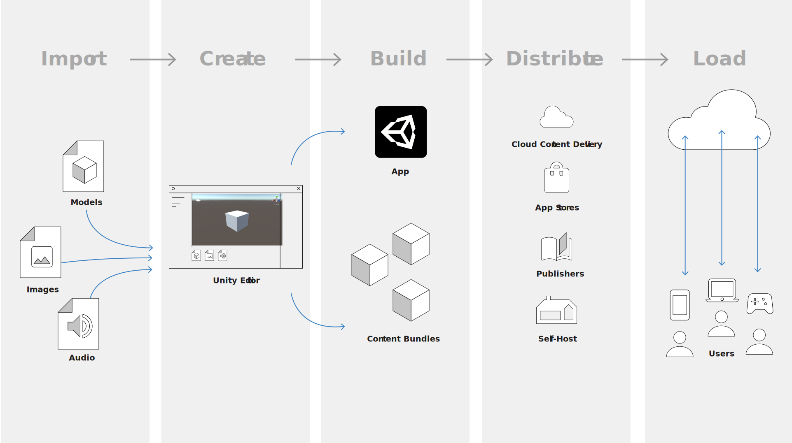
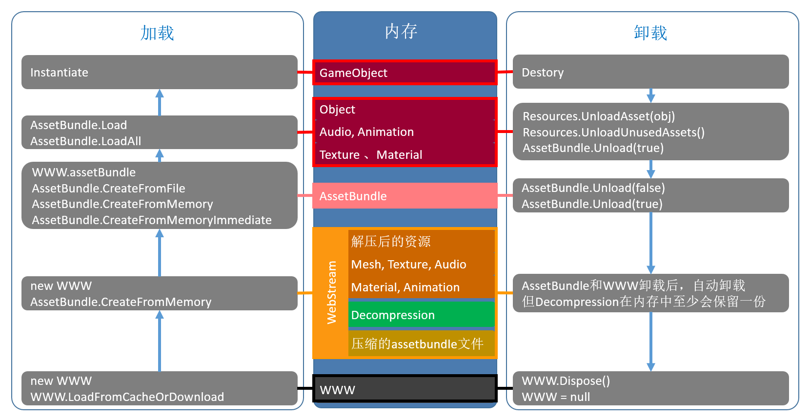
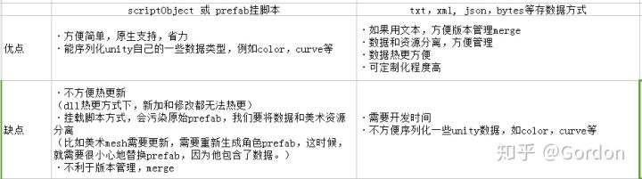

- [基础知识](#基础知识)
  - [UnityEvent](#unityevent)
  - [Hash表的原理是什么, 如何实现?](#hash表的原理是什么-如何实现)
  - [简述一下对象池，你觉得在FPS里哪些东西适合使用对象池](#简述一下对象池你觉得在fps里哪些东西适合使用对象池)
  - [[MenuItem] 什么意思?](#menuitem-什么意思)
  - [Image与Raw Image的区别?](#image与raw-image的区别)
  - [Unity如何实现游戏截图？](#unity如何实现游戏截图)
  - [预设(prefab)的用处](#预设prefab的用处)
  - [请简述OnBecameVisible及OnBecameInvisible的发生时机，以及这一对回调函数的意义？](#请简述onbecamevisible及onbecameinvisible的发生时机以及这一对回调函数的意义)
  - [在编辑场景时将GameObject设置为Static有何作用？](#在编辑场景时将gameobject设置为static有何作用)
  - [DestroyImmediate和Destroy的区别是？](#destroyimmediate和destroy的区别是)
- [框架设计](#框架设计)
  - [Unity项目框架是如何设计的？有哪些原则?](#unity项目框架是如何设计的有哪些原则)
  - [资源管理的平台，版本，渠道是如何管理的？](#资源管理的平台版本渠道是如何管理的)
  - [项目框架是如何让美术，策划，程序愉快的工作的？](#项目框架是如何让美术策划程序愉快的工作的)
  - [Unity如何避免多人提交代码冲突？多人协作模式。](#unity如何避免多人提交代码冲突多人协作模式)
  - [真机调试，看打印日志你是如何处理的？](#真机调试看打印日志你是如何处理的)
  - [框架设计里面你常用的第三方库和插件是哪些？解决哪些问题？](#框架设计里面你常用的第三方库和插件是哪些解决哪些问题)
  - [聊聊ECS框架，面向数据的技术堆栈 (DOTS)](#聊聊ecs框架面向数据的技术堆栈-dots)
- [摄像机](#摄像机)
  - [摄像机有几种模式，成像原理分别是什么？](#摄像机有几种模式成像原理分别是什么)
  - [将Camera组件的ClearFlags选项选成Depth only是什么意思？有何用处？](#将camera组件的clearflags选项选成depth-only是什么意思有何用处)
  - [游戏场景中可能同时存在哪些Camera？他们一般怎么设置？以及起到的作用？](#游戏场景中可能同时存在哪些camera他们一般怎么设置以及起到的作用)
- [物理](#物理)
  - [Unity碰撞检测原理](#unity碰撞检测原理)
  - [连续碰撞检测 (CCD)](#连续碰撞检测-ccd)
  - [物体发生碰撞的必要条件？](#物体发生碰撞的必要条件)
  - [Unity3d中的碰撞器和触发器的区别？](#unity3d中的碰撞器和触发器的区别)
  - [射线检测碰撞物](#射线检测碰撞物)
  - [物理更新一般放在哪个系统函数里](#物理更新一般放在哪个系统函数里)
  - [什么叫做链条关节？](#什么叫做链条关节)
  - [CharacterController和Rigidbody的区别](#charactercontroller和rigidbody的区别)
  - [MeshCollider和其他Collider的一个主要不同点？](#meshcollider和其他collider的一个主要不同点)
- [动画](#动画)
  - [动画状态机驱动的是什么](#动画状态机驱动的是什么)
  - [Animation中Curves如何使用](#animation中curves如何使用)
  - [请描述游戏动画有哪几种，以及其原理？](#请描述游戏动画有哪几种以及其原理)
- [Unity 协程](#unity-协程)
  - [什么是协同程序？](#什么是协同程序)
  - [协程的应用](#协程的应用)
  - [Unity协程底层实现](#unity协程底层实现)
- [Unity脚本生命周期 MonoBehaviour](#unity脚本生命周期-monobehaviour)
- [Unity3D 跨平台](#unity3d-跨平台)
  - [Unity和Android与iOS如何交互？](#unity和android与ios如何交互)
  - [Unity如何统计安卓PSS内存？](#unity如何统计安卓pss内存)
  - [Android/iOS平台的纹理格式分别设置成什么？有什么好处？](#androidios平台的纹理格式分别设置成什么有什么好处)
- [Unity UI](#unity-ui)
  - [请简述如何在不同分辨率下保持UI的一致性](#请简述如何在不同分辨率下保持ui的一致性)
  - [UGUI消息传递机制](#ugui消息传递机制)
  - [UI动画实现方案:](#ui动画实现方案)
  - [Unity渲染顺序](#unity渲染顺序)
    - [UGUI渲染顺序](#ugui渲染顺序)
    - [UI上粒子效果如何实现](#ui上粒子效果如何实现)
    - [如何在UI上显示模型](#如何在ui上显示模型)
  - [Canvas](#canvas)
    - [画布组 (Canvas Group)](#画布组-canvas-group)
  - [UGUI渲染细节](#ugui渲染细节)
    - [合批过程（Canvases）](#合批过程canvases)
    - [重绘过程（Graphics）](#重绘过程graphics)
    - [排版重建](#排版重建)
    - [图形重建](#图形重建)
    - [网格更新（对应Canvas.SendWillRenderCanvases）](#网格更新对应canvassendwillrendercanvases)
    - [网格重建/合并（对应Canvas.BuildBatch）](#网格重建合并对应canvasbuildbatch)
  - [UGUI的优化](#ugui的优化)
    - [合理的分配图集](#合理的分配图集)
    - [降低界面的更新开销 动静分离](#降低界面的更新开销-动静分离)
    - [UI的一些优化建议](#ui的一些优化建议)
- [性能与调优](#性能与调优)
  - [谈谈做游戏优化的一般思路是什么？ && 谈谈Unity游戏引擎里面耗性能的主要有哪些地方？](#谈谈做游戏优化的一般思路是什么--谈谈unity游戏引擎里面耗性能的主要有哪些地方)
  - [如何查看游戏性能](#如何查看游戏性能)
  - [了解 Unity 中的优化](#了解-unity-中的优化)
  - [优化注意事项](#优化注意事项)
- [Unity 的 内存](#unity-的-内存)
  - [Unity是一个C++引擎](#unity是一个c引擎)
  - [Native Memory](#native-memory)
    - [优化 Native Memory](#优化-native-memory)
  - [Managed Memory](#managed-memory)
    - [Native VM memory](#native-vm-memory)
    - [GC](#gc)
    - [堆栈](#堆栈)
    - [堆积](#堆积)
    - [优化 Managed Memory](#优化-managed-memory)
  - [Memory in Unity](#memory-in-unity)
    - [Three memory management layers](#three-memory-management-layers)
    - [Memory fragmentation and heap expansion](#memory-fragmentation-and-heap-expansion)
    - [Memory allocator customization](#memory-allocator-customization)
    - [garbage collection](#garbage-collection)
- [资源](#资源)
  - [资产](#资产)
    - [Instance ID](#instance-id)
    - [资源的生命周期](#资源的生命周期)
    - [如何安全的在不同工程间安全地迁移asset数据？三种方法](#如何安全的在不同工程间安全地迁移asset数据三种方法)
    - [当删除Unity工程Assets目录下的meta文件时会导致什么？为什么？](#当删除unity工程assets目录下的meta文件时会导致什么为什么)
  - [Resources](#resources)
  - [资源数据库(class in UnityEditor)](#资源数据库class-in-unityeditor)
  - [AssetBundle](#assetbundle)
    - [AssetBundle结构](#assetbundle结构)
    - [AssetBundle manifests](#assetbundle-manifests)
    - [加载 AssetBundle](#加载-assetbundle)
    - [AB包依赖](#ab包依赖)
    - [AssetBundle.Unload](#assetbundleunload)
    - [管理 AssetBundle](#管理-assetbundle)
    - [AB包内存](#ab包内存)
  - [Unity有哪些特定的文件夹名字，有什么作用？](#unity有哪些特定的文件夹名字有什么作用)
  - [清单文件](#清单文件)
  - [资源管理是如何做的，如何更新与打空包？你的项目是如何做热更新的？](#资源管理是如何做的如何更新与打空包你的项目是如何做热更新的)
  - [(OLD)动态加载资源的方式？](#old动态加载资源的方式)
  - [Addressable 管理资源的优势有哪些？](#addressable-管理资源的优势有哪些)
  - [数据序列化](#数据序列化)
- [其它](#其它)
  - [IL2CPP & Mono](#il2cpp--mono)
  - [托管代码剥离](#托管代码剥离)
  - [UnityWebRequest](#unitywebrequest)
  - [Addressables](#addressables)
  - [Unity-Technologies AssetBundles-Browser](#unity-technologies-assetbundles-browser)


# 基础知识

## UnityEvent

借助 UnityEvent 可让用户驱动的回调从编辑时间一直持续到运行时，无需进行额外的编程和脚本配置。

UnityEvent 对许多方面都很有用：
- 内容驱动的回调
- 解耦系统
- 持久回调
- 预配置的调用事件

UnityEvent 可添加到任何 MonoBehaviour，并从标准 .net 委托之类的代码中执行。当 UnityEvent 添加到 MonoBehaviour 时，它会出现在 Inspector 中，并可添加持久回调。

UnityEvent 与标准委托有类似的限制。也就是说，它们会保留对目标元素的引用，而这会阻止对目标进行垃圾收集。如果将 UnityEngine.Object 作为目标，而本机表示消失，则不会调用回调。

## Hash表的原理是什么, 如何实现?

[C# 学习笔记：散列与哈希](https://blog.csdn.net/qq_38601621/article/details/100350691)

## 简述一下对象池，你觉得在FPS里哪些东西适合使用对象池

（空间获取时间）

对象池就存放需要被反复调用资源的一个空间，当一个对象回大量生成的时候如果每次都销毁创建会很费时间，通过对象池把暂时不用的对象放到一个池中（也就是一个集合），当下次要重新生成这个对象的时候先去池中查找一下是否有可用的对象，如果有的话就直接拿出来使用，不需要再创建，如果池中没有可用的对象，才需要重新创建，利用空间换时间来达到游戏的高速运行效果，在FPS游戏中要常被大量复制的对象包括子弹，敌人，粒子等

## [MenuItem] 什么意思?
MenuItem 属性用于向主菜单和检视面板上下文菜单添加菜单项。

该 MenuItem 属性能够将任何静态函数转变为菜单命令。仅静态函数可使用 MenuItem 属性。

## Image与Raw Image的区别?
图像控件要求其纹理为精灵，而原始图像可以接受任何纹理。

由于原始图像不需要精灵纹理，因此可以使用这种图像来显示 Unity 播放器可用的任何纹理。例如，可使用 WWW 类显示从 URL 下载的图像，或显示来自游戏对象的纹理。

UV Rectangle 属性允许显示较大图像的一小部分。X 和 Y 坐标指定图像的哪个部分与控件的左下角对齐。例如，X 坐标为 0.25 将会截断图像的最左边四分之一。W 和 _H_（即宽度和高度）属性指示了要进行缩放来适应控件矩形的图像部分的宽度和高度。例如，宽度和高度为 0.5 将会将图像区域放大四分之一来适应控件矩形。通过更改这些属性，即可根据需要缩放图像。

## Unity如何实现游戏截图？
[ScreenCapture](https://docs.unity3d.com/cn/2021.2/ScriptReference/ScreenCapture.html)

## 预设(prefab)的用处
Prefab是预设体，在实例化的时候用到，主要用于经常会用到的物体，属性方便修改。

在游戏运行时实例化，Prefab相当于一个模板，对已经有的素材、脚本、参数做一个默认的配置，以便于以后的修改，同时Prefab打包的内容简化了导出的操作，便于团队的交流。

1.Prefab一个重要的优势就是编辑prefab资源后，场景中所有使用Prefab克隆的游戏对象将全部使用新编辑的资源，无需一个一个的给场景中的对象赋值。
2.当游戏中需要频繁创建一个物体时，使用Prefab能够节省内存。
3.当你在一个场景中增加一个Prefabs，你就实例化了一个Prefabs。

## 请简述OnBecameVisible及OnBecameInvisible的发生时机，以及这一对回调函数的意义？
当物体是否可见切换之时。可以用于只需要在物体可见时才进行的计算。

## 在编辑场景时将GameObject设置为Static有何作用？
设置游戏对象为Static时，这些部分被静态物体挡住而不可见时，将会剔除（或禁用）网格对象。因此，在你的场景中的所有不会动的物体都应该标记为Static。

## DestroyImmediate和Destroy的区别是？
DestroyImmeditate 销毁对象的时候，会立即释放资源。Destroy只是从该场景销毁，但是还在内存当中。

DestroyImmeditate 函数应只在编写 Editor 代码时使用，因为在编辑模式下， 永远不会调用延迟销毁。 在游戏代码中，您应该改用 Object.Destroy。Destroy 始终延迟进行 （但在同一帧内执行）。 使用该函数时要务必小心，因为它可以永久销毁资源！ 另请注意，切勿循环访问数组并销毁正在迭代的元素。这会导致严重的问题（这是一条通用的编程实践，而不仅仅是在 Unity 中）。


# 框架设计

## Unity项目框架是如何设计的？有哪些原则?


[unity游戏框架学习-框架结构](https://www.cnblogs.com/wang-jin-fu/p/10975660.html)

## 资源管理的平台，版本，渠道是如何管理的？
## 项目框架是如何让美术，策划，程序愉快的工作的？
## Unity如何避免多人提交代码冲突？多人协作模式。

[Unity中的Git最佳实践](https://blog.csdn.net/zhenghongzhi6/article/details/87889058)

[Unity快速开发和协作的模式](https://zhuanlan.zhihu.com/p/65912649)

>多研究些问题，少谈些主义
[讨论：Unity SVN vs Git， 兼谈研究问题](https://zhuanlan.zhihu.com/p/39049433)

美术人员输出了UI资源，原画，特效等传到ftp通知程序具体路径，程序从FTP拷贝资源到UnityUI资源文件夹，为了版本一致，程序同学可能需要对它进行重命名，才用上了一张新资源。

## 真机调试，看打印日志你是如何处理的？
[unity游戏框架学习-日志系统](https://www.cnblogs.com/wang-jin-fu/p/11263310.html)

1.日志开关。只有开发版本开启日志,因为日志还是比较耗性能的。。。

2.堆栈日志界面：ERROR时弹出界面，该界面显示错误的堆栈日志。大半部分错误日志是不会导致崩溃，如果不弹窗qa可能会漏掉一些重要的log信息。

3.接入SRDebugger，方便在qa测试时，在测试机查看详细的日志信息，方便定位错误出现的原因。

4.FPS帧率的显示

5.游戏正式上线以后，我们很难拿到用户的错误日志，这时候我们需要把错误的日志上传到我们的服务器

6.当游戏崩溃时我们是拿不到unity打印的日志的，这时候就需要接入FireBase了，它可以帮我们把崩溃的详细日志上传到网页上，方便我们查看


## 框架设计里面你常用的第三方库和插件是哪些？解决哪些问题？

[Unity Asset Store上优质好用的47款插件——Unity开发者必备工具（适合收藏）](https://zhuanlan.zhihu.com/p/62471100)

　　1.图集检查工具、图集名字设置工具

　　2.ab包名字、依赖检查工具

　　3.资源导入检查设置

　　4.配置、服务器协议同步工具


## 聊聊ECS框架，面向数据的技术堆栈 (DOTS)

Entity为ECS中基本的成员

Component是Entity的一个属性

ArcheType是由某几个固定Component组成的Entity原型

ComponentSystem为System在Unity ECS中的实现。一个ComponentSystem会对含有某些Component的Entity执行一些特定的操作，通常继承自ComponentSystem或JobComponentSystem。区别是继承ComponentSystem只会在主线程执行，而继承自JobComponentSystem的则可以利用JobSystem来进行多线程并发处理，但同时对应操作过程中的限制也更严格。在大部分情况下应当尽量使用JobComponentSystem来完成相关的操作，从而提升性能。

[浅谈Unity ECS（一）Uniy ECS基础概念介绍：面向未来的ECS](https://zhuanlan.zhihu.com/p/59879279)

[ECS的泛泛之谈](https://zhuanlan.zhihu.com/p/41652478)

[浅入浅出Unity ECS](https://zhuanlan.zhihu.com/p/51289405)

# 摄像机

## 摄像机有几种模式，成像原理分别是什么？
- Perspective：摄像机将以完整透视角度渲染对象。
- Orthographic：摄像机将均匀渲染对象，没有透视感。注意：在正交模式下不支持延迟渲染。始终使用前向渲染。

## 将Camera组件的ClearFlags选项选成Depth only是什么意思？有何用处？

[摄像机](https://docs.unity3d.com/cn/2022.1/Manual/class-Camera.html)

每个摄像机在渲染其视图时都会存储颜色和深度信息。屏幕中未绘制的部分为空，默认情况下将显示天空盒。使用多个摄像机时，每个摄像机都会在缓冲区中存储自己的颜色和深度信息，随着每个摄像机渲染而累积越来越多数据。场景中的任何特定摄像机渲染其视图时，您可以设置 Clear Flags 来清除不同的缓冲区信息集合。

Depth：摄像机在绘制顺序中的位置。具有更大值的摄像机将绘制在具有更小值的摄像机之上。

## 游戏场景中可能同时存在哪些Camera？他们一般怎么设置？以及起到的作用？

主相机,主相机渲染主场景用透视摄像机

UI相机,UI相机渲染UI用正交相机。

深度相机,根据需求设置的, 可以通过设置深度保证某些对象一直在最前面显示


# 物理
## Unity碰撞检测原理

[深入理解Unity的碰撞检测机制](https://www.jianshu.com/p/988865b02019)

碰撞检测是几何问题，用来判断两个物体是否相交的算法有很多。99%的情况下，使用简单的包围球，胶囊体，包围长方体等的效果不逊于有些复杂的碰撞算法。

如果物体数量非常非常多，提高直线交点计算函数和包围体检测函数的速度于事无补，只能从不同角度来解决碰撞检测问题，即使用空间划分技术。

二元空间划分(binary space partition)

包围体层次结构（BHV）/ 八叉树

## 连续碰撞检测 (CCD)

计算量最小，从此帧到上帧的位置连一条线，检测这条线有没有碰撞检测。

## 物体发生碰撞的必要条件？

两个物体都必须带有碰撞器（Collider），其中一个物体还必须带有Rigidbody刚体，而且必须是运动的物体带有Rigidbody脚本才能检测到碰撞。

[碰撞体](https://docs.unity3d.com/cn/2021.2/Manual/CollidersOverview.html)


## Unity3d中的碰撞器和触发器的区别？

碰撞器是触发器的载体，而触发器只是碰撞器身上的一个属性。

当Is Trigger=false时，碰撞器根据物理引擎引发碰撞，产生碰撞的效果，可以调用OnCollisionEnter/Say/Exit函数；

当Is Trigger=true时，碰撞器被物理引擎忽略，没有碰撞效果，可以调用OnTriggerEnter/Stay/Exit函数。

如果既要检测到物体的接触又不想让碰撞检测影响物体移动或要检测一个物体是否经过空间中的某个区域这时就可以用到触发器。

消息|描述
------------ | -------------
OnCollisionEnter |当该碰撞体/刚体已开始接触另一个刚体/碰撞体时，调用 OnCollisionEnter。
OnCollisionExit	|当该碰撞体/刚体已停止接触另一个刚体/碰撞体时，调用 OnCollisionExit。
OnCollisionStay	|OnCollisionStay is called once per frame for every Collider or Rigidbody that touches another |Collider or Rigidbody.
OnTriggerEnter	|GameObject 与另一个 GameObject 碰撞时，Unity 会调用 OnTriggerEnter。
OnTriggerExit |当 Collider other 已停止接触该触发器时调用 OnTriggerExit。
OnTriggerStay	|对于正在接触该触发器的每个其他 Collider，“几乎”所有帧都调用 OnTriggerStay。此函数位于物理计时器上，因此它不必运行每个帧。

## 射线检测碰撞物
[Unity最佳实践-物理最佳实践](https://blog.csdn.net/greedylin/article/details/80645860)

射线是3D世界中一个点向一个方向发射的一条无终点的线，在发射轨迹中与其他物体发生碰撞时，它将停止发射。
注意这条线是逻辑上的，界面上看不到。一般使用射线判断是否发射至某个游戏对象上或者获得鼠标点击的游戏对象等。

射线是从摄像机发出去的。
```
Ray ray=Camera.main.ScreenPointToRay(Input.mousePosition);
if(Physics.Raycast(ray,out hit))//如果命中
{
    print(hit.collider.gameObject);//可以获得命中的游戏对象
}
//Physics.RaycastAll 投射一条光线返回所有碰撞
```

## 物理更新一般放在哪个系统函数里
FixedUpdate，每固定帧绘制时执行一次，和Update不同的是FixedUpdate是渲染帧执行，如果你的渲染效率低下的时候FixedUpdate调用次数就会跟着下降。FixedUpdate比较适用于物理引擎的计算，因为是跟每帧渲染有关。Update就比较适合做控制。

## 什么叫做链条关节？
铰链关节 (Hinge Joint) 将两个刚体组合在一起，对刚体进行约束，让它们就像通过铰链连接一样移动。铰链关节非常适合用于门，但也可用于模拟链条、钟摆等对象。

## CharacterController和Rigidbody的区别

CharacterController 可使您轻松进行受碰撞约束的移动，同时不必处理刚体。

CharacterController 不受力影响，仅在您调用 **Move** 函数时才会移动。 然后它执行移动，但受碰撞约束。

Rigidbody具有完全真实物理的特性，Unity中物理系统最基本的一个组件，包含了常用的物理特性，而CharacterController可以说是受限的的Rigidbody，具有一定的物理效果但不是完全真实的。
主要用于第三人称玩家控制或者是不使用刚体物理组件的第一人称玩家控制。


## MeshCollider和其他Collider的一个主要不同点？

[网格碰撞体](https://docs.unity3d.com/cn/2021.2/Manual/class-MeshCollider.html)

网格烹制将常规网格更改为可以在物理引擎中使用的网格。烹制会构建用于物理查询的**空间搜索结构**（如 Physics.Raycast）以及用于接触生成的支持结构。Unity 在碰撞检测中使用网格之前烹制所有这些网格。这可在导入时 (Import Settings > Model > Generate Colliders) 或运行时进行。

不应修改用于碰撞体的网格几何体，因为每次更改网格时，物理引擎都必须重建内部网格碰撞加速结构。这会导致大量的性能开销。对于需要在运行时发生碰撞和进行更改的网格，通常最好使用诸如胶囊体、球体和盒体之类的原始碰撞体来模拟网格形状。

# 动画

## 动画状态机驱动的是什么
Mecanim 使用类似于流程图的可视化布局系统来表示**状态机**，从而控制需要在角色或对象上使用的动画剪辑并对这些动画剪辑排序。

## Animation中Curves如何使用
切换至Curves后，可以添加Property,通过选择不同的属性，在视图中添加Key点修改函数曲线，从而实现物体的各种动画效果、颜色渐变等

## 请描述游戏动画有哪几种，以及其原理？

- 精灵动画(Sprite animation)：It takes a sequence of images or frames and plays them in order at a specified frame rate to achieve a consistent and animated look,

- 刚体动画/关键帧动画(Rigid body animation)：Rigid body animation is used to create pre-made animation sequences that move or change the properties of objects. Thus, in rigid body animation, changes across key frames apply to whole objects and their highest level properties. 

- 骨骼动画(Rigged or bone-based animation)：Typically, bone-based animation is created as a complete animation sequence in 3D modeling software and is imported to Unity inside a mesh file.

- 顶点变形动画(Morph animation)：Essentially, this method relies on snapshots of a mesh's vertices across key frames in an animation, and blends between the states via tweens. The downside to this method is its computational expense. It's typically performance intensive, but its results can be impressive and highly realistic. 

- 物理动画(Physics-based animation)：You need animation that appears realistic and yet responds to its world dynamically, based on decisions made by the player and other variable factors of the world that cannot be predicted ahead of time.

- 粒子动画(Particle animation)： But you'll frequently need to animate less tangible, less solid, and less physical matter, such as smoke, fire, bubbles, sparkles, smog, swarms, fireworks, clouds, and others. For these purposes, a particle system is indispensable. 

# Unity 协程

## 什么是协同程序？

在主线程运行的同时开启另一段逻辑处理，来协助当前程序的执行，协程很像多线程，但是不是多线程，Unity的协程实在每帧结束之后去检测yield的条件是否满足。

协程不是多线程，协程还是在主线程里面（注：在Unity中非主线程是不可以访问Unity资源的）。除主线程之外的线程无法访问Unity3D的对象、组件、方法。

协程功能类似与多线程，StartCoroutine()-----yield WaitForSecond-----StopCoroutine()

协程背后通过迭代器实现，主要实现了两个接口，IEnumerator和IEnumerable，接口的方法重要有三个方法，MoveNext()---Current--Dispose()

协程的返回值是 IEnumerator类型,而在协程内部必须有yield return **,IEnumerator用来记录执到yield return的位置,每次执行协程时均是从当前位置向后执行,而不是从协程的最开始位置执行,除非只有一个yield return。

## 协程的应用

分帧

定时器操作

异步加载资源

## Unity协程底层实现

[Unity 协程原理探究与实现](https://www.cnblogs.com/yespi/p/9847533.html)

[Unity协程的原理与应用](https://zhuanlan.zhihu.com/p/279383752)

迭代器是C#中一个十分强大的功能，只要类继承了IEnumerable接口或者实现了GetEnumerator()方法就可以使用foreach去遍历类，遍历输出的结果是根据GetEnumerator()的返回值IEnumerator确定的，为了实现IEnumerator接口就不得不写一堆繁琐的代码，而yield关键字就是用来简化这一过程的。

C#中的迭代器方法其实就是一个协程，你可以使用yield来暂停，使用MoveNext()来继续执行。 当一个方法的返回值写成了IEnumerator类型，他就会自动被解析成迭代器方法（后文直接称之为协程），你调用此方法的时候不会真的运行，而是会返回一个迭代器，需要用MoveNext()来真正的运行。

协程分为两部分，协程与协程调度器：协程仅仅是一个能够中间暂停返回的函数，而协程调度是在MonoBehaviour的生命周期中实现的。 准确的说，Unity只实现了协程调度部分，而协程本身其实就是用了C#原生的”迭代器方法“。

# [Unity脚本生命周期 MonoBehaviour](https://docs.unity3d.com/cn/2021.2/Manual/ExecutionOrder.html)


初始化：函数Awake(激活游戏对象)----OnEnable(实例化游戏对象)-----Start(初始化)

更新顺序：FixedUpdate(物理计算，处理刚体)----Update()----LateUpdate(相机跟随)

渲染部分：OnBecameVisible/Invisible(相机中可见或不可见)----OnGUI(执行键盘和鼠标事件)

对象销毁和退出场景：OnDisable(不激活对象)----OnDestroy(销毁游戏对象)-----OnApplicationQuit(游戏场景退出)

1. Awake：用于在游戏开始之前初始化变量或游戏状态。在脚本整个生命周期内它仅被调用一次.Awake在所有对象被初始化之后调用，所以你可以安全的与其他对象对话或用诸如GameObject.FindWithTag()这样的函数搜索它们。每个游戏物体上的Awake以随机的顺序被调用。因此，你应该用Awake来设置脚本间的引用，并用Start来传递信息Awake总是在Start之前被调用。它不能用来执行协同程序。

2. OnEnable：（仅在对象处于激活状态时调用）在启用对象后立即调用此函数。

3. Reset：在用户点击检视面板的Reset按钮或者首次添加该组件时被调用。此函数只在编辑模式下被调用。Reset最常用于在检视面板中给定一个默认值。

4. Start：仅在Update函数第一次被调用前调用。Start在behaviour的生命周期中只被调用一次。它和Awake的不同是Start只在脚本实例被启用时调用。你可以按需调整延迟初始化代码。Awake总是在Start之前执行。这允许你协调初始化顺序。在所有脚本实例中，Start函数总是在Awake函数之后调用。

5. FixedUpdate：固定帧更新，在Unity导航菜单栏中，点击“Edit”-->“Project Setting”-->“Time”菜单项后，右侧的Inspector视图将弹出时间管理器，其中“Fixed Timestep”选项用于设置FixedUpdate()的更新频率，更新频率默认为0.02s。（yield WaitForFixedUpdate、Internal physics update、 OnTriggerXXX、 OnCollisionXXX、OnMouseXXX）

6. Update：正常帧更新，用于更新逻辑。每一帧都执行，处理Rigidbody时，需要用FixedUpdate代替Update。例如:给刚体加一个作用力时，你必须应用作用力在FixedUpdate里的固定帧，而不是Update中的帧。FixedUpdate比较适用于物理引擎的计算，因为是跟每帧渲染有关。Update就比较适合做控制。（yield null、yield WaitForScends、yield WWW、yield StartCoroutine、Internal animation update）

7. LateUpdate：在所有Update函数调用后被调用，和fixedupdate一样都是每一帧都被调用执行，这可用于调整脚本执行顺序。例如:当物体在Update里移动时，跟随物体的相机可以在LateUpdate里实现。LateUpdate,在每帧Update执行完毕调用，他是在所有update结束后才调用，比较适合用于命令脚本的执行。官网上例子是摄像机的跟随，都是在所有update操作完才跟进摄像机，不然就有可能出现摄像机已经推进了，但是视角里还未有角色的空帧出现。（OnWillRenderObject、OnPreCull、OnBecameVisible、OnBecameInvisible、OnPreRender、OnRenderObject、OnPostRender、OnRenderImage、OnDrawGizmos）

8. OnGUI：在渲染和处理GUI事件时调用。比如：你画一个button或label时常常用到它。这意味着OnGUI也是每帧执行一次。（yield WaitForEndOfFrame、OnApplicationPause）

9. OnApplicationQuit：在退出应用程序之前在所有游戏对象上调用此函数。在编辑器中，用户停止播放模式时，调用函数。

10. OnDisable：当物体被销毁时 OnDisable将被调用，并且可用于任意清理代码。脚本被卸载时，OnDisable将被调用，OnEnable在脚本被载入后调用。注意： OnDisable不能用于协同程序。

11. OnDestroy：当MonoBehaviour将被销毁时，这个函数被调用。OnDestroy只会在预先已经被激活的游戏物体上被调用。注意：OnDestroy也不能用于协同程序。

# Unity3D 跨平台

## Unity和Android与iOS如何交互？

[unity游戏框架学习-SDK接入](https://www.cnblogs.com/wang-jin-fu/p/11017653.html)

[Unity与Android交互-基础知识](https://blog.csdn.net/jiaxunnanling/article/details/89947744)

首先介绍一点关于Android与unity通信的知识：

完成通信主要靠unity中的class.jar包（在unity的安装目录下）。

- 在unity中调用android的方法：jo.call("方法名"[,参数名])             其中[]代表可有可无。

- 在android中调用unity的方法：导入class.jar包，继承UnityPlayerActivity，使用UnityPlayer.UnitySendMessage("游戏对象名"，"unity中的方法名","参数")

## [Unity如何统计安卓PSS内存？](https://zhuanlan.zhihu.com/p/372883142)

PSS- Proportional Set Size 实际使用的物理内存（比例分配共享库占用的内存）

Android有一个内存管理工具：Low Memory Killer，当内存不足时，会清理内存，在Android上常见的一些后台app消失，一些手机服务消失，手机重启或者是app崩溃闪退等都和它有关。

内存指标：RSS >= PSS >= USS

## Android/iOS平台的纹理格式分别设置成什么？有什么好处？

[Unity纹理压缩与相关优化知识汇总](https://zhuanlan.zhihu.com/p/260761440)

文件格式是图像为了存储信息而使用的编码方式，但是他不能被CPU所识别，GPU的特性是做向量运算；因此这些文件被游戏读入时还需要CPU解压成R8G8B8等像素格式，再传送到GPU端使用；而在运行时做解压无疑是非常耗的，所以一般在图片源文件导入时就会为其生成纹理格式的文件。

纹理格式是可以被GPU所识别的像素格式，可以被快速寻址采样。但是直接使用这种纹理格式会导致资源的加载时间长、内存占用大的问题，尤其在移动平台上更加明显，因此，为了解决这个问题，就出现了压缩纹理格式；

纹理压缩格式

Unity支持许多图片格式的源文件，但是3D图形的实时渲染中不会用这些格式，3D图形硬件要求纹理以专门格式进行压缩，这些格式对快速纹理采样进行了优化，DXT,ETC等压缩纹理格式可以在游戏运行中**无需CPU解压就被GPU直接采样**。每个不同的平台和设备都有自己的专有格式，因此在选择压缩方式时需要考虑兼容性。

选择纹理压缩格式的策略

我们的思路是让需要展示出高品质的纹理占用更多的资源，让那些没必要展示高品质的纹理占用更少的资源；
- 尽量避免RGBA32和ARGB32纹理的使用，因为这种格式一般属于高清晰的，但也比较耗；
- RGBA16格式的加载效率也很高，接近于ETC1/PVRTC，设备越好，差距越小，因此在ETC1/PVRTC的效果不够好时，可以尝试用RGBA16；
- UI贴图要注意Mipmap和read&write属性的设置；
- 粒子贴图大小一般要在256x256一下；
- 对于模型、场景贴图，我们需要根据不同用途的贴图做不同的压缩处理，如果使用ASTC格式，可以参考NVIDIA官网给出的测试数据来选择；

# Unity UI

## 请简述如何在不同分辨率下保持UI的一致性

使用锚点来适应不同的宽高比

在画布缩放器 (Canvas Scaler)组件中，可将其 UI Scale Mode 设置为 Scale With Screen Size。使用此缩放模式，可以指定要用作参考的分辨率。如果当前屏幕分辨率小于或大于此参考分辨率，则会相应设置画布的缩放因子，使所有 UI 元素都与屏幕分辨率一起放大或缩小。 

## [UGUI消息传递机制](https://blog.csdn.net/fansongy/article/details/82079639)

[事件系统](https://docs.unity3d.com/cn/2022.1/Manual/EventSystem.html)

## UI动画实现方案:

1.帧动画方式实现: 将UI动画每一帧都制作成贴图, 然后在UI身上挂载脚本, 通过修改UI身上的图片来达到动画效果

2.使用特定的shader, 这个需要专门shader的支持

3.如果你指的UI的Transform动画, 那么可以使用插值计算(对位置, 旋转和缩放), 也可以使用市面常用的插件动画, 如dotween

## Unity渲染顺序

[Unity渲染顺序总结](https://www.jianshu.com/p/0341f0ab9020)

[对unity UI层级的一些思考](https://zhuanlan.zhihu.com/p/344773681)

Camera->RenderQueue->深度->sortingLayer->sortingOrder

按默认管线来说，camera的depth为最高，depth值越大，越在前面。

然后是RenderQueue，在逻辑上将渲染的物体分成几个大类。内部对不同类型有不同策略，透明从后往前，不透明从前往后。

最终Renderer基类的sortingLayer和sortingOrder决定每个render的提交顺序。

对于UI来说，都是透明渲染，所以sortingOrder就是最关键的参数了。

### UGUI渲染顺序

依次由Render Camera的Depth值、Sorting  Layer先后顺序、Order in Layer值决定

- Render Camera不同时，由Render Camera的Depth决定

- Render Camera相同时，由Sorting Layer先后顺序决定

- Render Camera相同时，Sorting Layer相同，由Order in Layer值决定。

1.OverLay模式，永远覆盖在其他物体之上。出现在最上面。不受摄像机的Depth值影响。

2.有多个摄像机时，由摄像机的Depth值决定

3.只有一个摄像机时，由距离和方向决定World模式和Camera模式、它们的渲染结果 可前、可后、可穿插。

同一个Canvas下，UI对象在Hierarchy窗口中越往上越先渲染，越往下越后渲染。

### UI上粒子效果如何实现
- screenspace overlay 
[mob-sakai/ParticleEffectForUGUI](https://github.com/mob-sakai/ParticleEffectForUGUI)

- screenspace camera
新画布 + 能被层内排序影响到的只渲染UI层的摄像机 + sortingOrder更高的粒子系统

如果需要在两个UI层之间显示特效怎么办？

首先Canvas选择RenderCamera才能渲染特效。

方案一：特效和Canvas排序

一个Canvas下不管是几个drawcall，对于和特效排序来说都是一个，特效不会穿插在Canvas下的节点之中。

UI分多个Canvas，调整orderinlayer，特效值在中间。

或是order相同，调整特效的z值，但是这样特效只会被Canvas完全挡住或是完全挡住Canvas，不能实现夹在中间的效果，相当于是特效和UI整体做了个排序。

方案二：将特效转换成CanvasRenderer渲染，这样的好处是不增加额外drawcall。这个开源库提供了两种实现方法。mob-sakai/ParticleEffectForUGUI。用到可以参考一下，简单来说就是设置material。

### 如何在UI上显示模型

首先要知道UI和模型之间的遮挡关系是怎么处理的。

因为模型一般是不透明渲染，不能用调整drawcall的方式让模型后渲染，当然也可以改shader，让UI上的模型特殊处理，但是这样会增加复杂度，不是很实用。

默认情况下，UI和模型的遮挡关系是按深度处理的，UI整体都是一个深度，也就是说模型只能完全挡住UI或是完全被UI挡住，不能实现在两个UI之间的效果。另外要注意模型是3D的，要在UI之上，z要足够大才行，否则会出现部分像素穿插。

如果要模型在UI之间，那就只能是RenderTexture或是多个相机了。

将模型转换为RenderTexture，这样的好处是比较灵活，可以实现多层次，而不增加多少drawcall，但是比直接放模型消耗大些，但是直接放模型不能夹在UI之间。

second camera

用第二个overlay摄像机 (Set the "depth" value on the second camera to a higher value than your main camera's "depth" value)，只渲染3D模型，然后把模型位置挪到UI上。

Render Texture
1. Set up a new Layer, lets call it "characterRender".
2. Assign your character to this layer.
3. Remove this layer from your main/GUI camera culling mask so that it does not get rendered.
4. Create a new camera, and set its culling mask to only "characterRender" layer.
5. Set its clear flags to Color only, and its color alpha to 0.
6. Place your character in front of the second camera (with gizmos enabled and the second camera selected in the hierarchy you can tweak the positioning with the camera preview)
7. Create a RenderTexture, and assign it as the Target Texture of the second camera.
8. Add that texture as a RawImage element to the GUI on your first camera.
9. Animate your character normally

## Canvas
画布 (Canvas) 组件表示进行 UI 布局和渲染的抽象空间。所有 UI 元素都必须是附加了画布组件的游戏对象的子对象。

传统上，渲染 UI 的效果就好像是直接在屏幕上绘制的简单图形设计。也就是说，没有摄像机观察 3D 空间的概念。Unity 便支持这种屏幕空间渲染方式，但也允许 UI 在场景中渲染为对象，具体取决于 Render Mode 属性的值。可用的模式包括 Screen Space - Overlay、Screen Space - Camera 和 World Space。

      Screen Space - Overlay：UI元素相对于屏幕空间，以2D方式显示在任何相机画面的上面。这是非常标准的 UI 风格。典型例子：大量窗口、文本和按钮的策略游戏。

      Screen Space - Camera：UI元素相对于屏幕空间，由指定的相机负责显示，相机的参数影响显示的结果。你可以把 Canvas 理解为相机的子物体。典型例子：射击游戏屏幕上的 3D HUD。

      World Space：UI元素相对于世界空间，和其他场景里的物体一样有世界位置、遮挡关系。通常用来做非常创新的 UI 设计。例子：游戏内的手机屏幕、与场景绑定的游戏指导等。


Canvas是Unity的一个内部组件（native-code Unity Component）。由Unity渲染系统使用，可以提供将在游戏世界空间中绘制的分层几何图形。

Canvas负责把它们上面几何体合并成批次，生成合适的渲染指令，发送给Unity的图像系统。所有这些都是Unity 本地C++代码实现的，被称作rebatch 或者 batch build。当一个Canvas被标记为包含需要被rebatch的几何图形，那这个Canvas被认为dirty。

几何图形通过 Canvas Render 组件传递给Canvas。

一个 Sub-canvas 是一个嵌套在另一个Canvas下的Canvas。Sub-canvas 是它的子级和它们的父级隔离：一个dirty的子级不会强制它的父级去重新生成几何图形，反之亦然。**（一个canvas是一个重绘单位）**

Layout components 控制RectTransform的大小和位置，通常被用来创建一些复杂的排版，这些排版依赖于它们内容的相对大小和相对位置。排版组件只依赖于RectTransform，并且只影响它们管理的RectTransform。它们不依赖图形类，并且它们可以独立于Unity UI图形组件使用。

图形组件和排版组件，都依赖于CanvasUpdateRegistry类，这是UnityEditor内不可见的接口。这个类记录那些需要被更新的排版和图形组件，并且当其关联的Canavs触发willRenderCanvases事件时，触发更新。

**图形组件和排版组件的更新被称为重建（rebuild）。**


### 画布组 (Canvas Group) 
可集中控制整组 UI 元素的某些方面，而无需单独处理每个元素。画布组的属性会影响所在的游戏对象以及所有子对象。

典型用途为：

- 通过在窗口的游戏对象上添加画布组并控制其 Alpha 属性来淡入或淡出整个窗口。
- 通过将画布组添加到父游戏对象并将其 Interactable 属性设置为 false 来使整组控件不可交互（“灰显”）。
- 通过在 UI 元素或其某个父元素上放置画布组 (Canvas Group) 组件并将其 Block Raycasts 属性设置为 false 来使一个或多个 UI 元素不阻止鼠标事件。

## UGUI渲染细节

[unity3D UI基础](https://zhuanlan.zhihu.com/p/147482988)

[Unity UI优化小结](https://zhuanlan.zhihu.com/p/43111806)

当使用Unity UI 制作用户界面时，记住，所有的被canvas绘制的图形都是被放在**透明渲染队列**。这意味着，Unity UI产生的图形都会使用透明混合（alpha blending）**从后向前渲染**。有一个重要的性能点要注意：**图形上的每一个像素都会被采样**，即使它被另一个不透明的图形完全覆盖。在移动设备上，大量的的过度绘制（overdraw）可以快速超出GPU填充率的上限。


### 合批过程（Canvases）
合批过程是指Canvas合并UI元素的网格，并且生成发送给Unity渲染管线的命令。这个过程产生的结果会被缓存住，直到他们被重新标记为dirty，组成它的任何一个网格变化都会使其变为dirty。

Canvas使用的网格都是从绑定在Canvas上的CanvasRenderer获得，但是不包含子Canvas的网格。

计算合批需要按照网格的深度，是否遮挡，是否共享材质等方面排序。这个操作是多线程的，因此不同的CPU结构，它的性能也不同，特别是移动SoCs（通常有几个CPU核）和台式CPU（通常有4个或更多的核）。

[UGUI优化系列(二) ------ 渲染概念](https://qianxi.blog.csdn.net/article/details/105404086)

1).遍历所有UI元素

2).根据UI Depth、Material ID、Texture ID、Render Order排序得出数组

3).筛选掉所有深度值为-1的UI元素

4).判断相邻元素是否进行合批，得到批次号


### 重绘过程（Graphics）
重绘过程是指Unity UI 的C# 图形组件的排版和网格被重新计算。这在 CanvasUpdateRegistry类中执行。

### 排版重建
要重新计算包含一个或多个布局组件合适的位置（大小），设置合适的层级顺序很重要。在层级监视器（hierarchy ）中排版靠近根节点的可以能会影响它子集的排版，所以需要被先计算。
为了实现这个，Unity UI 按照hierarchy中深度对dirty的排版组件排序，越高的（父节点少的）排在前面。排序后的布局组件被要求重建它们的布局；这就是通过改变布局组件来控制UI元素位置和大小。

### 图形重建
当重建UI的时候，Unity UI 会调用ICanvasElement的Rebuild接口。图形实现这个接口，在PreRender阶段执行两个步骤。

如果顶点数据被标记为dirty（如RectTransfom改变大小），那么需要重建网格。

如果材质数据标记为dirty（如材质或者纹理改变），关联的CanvasRenderer的材质也需要被更新。

图形重建不是通过按照指定顺序设置图形组件层级执行的，不需要任何排序操作。

### 网格更新（对应Canvas.SendWillRenderCanvases）

更新指的是UI元素本身的某些属性发生变化，从而需要重新生成，或者更新顶点属性(UIVertex结构)。总的来说，“网格更新”更新的是顶点属性。

重构因素（顶点数据变化）：

1) 激活图形(Graphic)组件

2) Graphic组件的大小，父节点变化

3) 任何颜色相关修改，例如：Image color, shadow effectColor等等

4) Image类型和参数修改，例如：Simple->Filled，fillCenter变化， fillAmount变化，sprite，uvRect变化等等

5) RawImage类型和参数修改，例如：texture，uvRect 变化

6) Text类型的字符串内容，字体，字体大小和对齐方式等修改，例如：text 字符串内容变化，supportRichText，resizeTextForBestFit，resizeTextMinSize，alignment，fontSize， horizontalOverflow，verticalOverflow，fontStyle变化等等

7) 其他：shadow组件 useGraphicAlpha effectDistance，effectColor变化

### 网格重建/合并（对应Canvas.BuildBatch）
在 UGUI 中，Batch是以Canvas为单位的，即在同一个Canvas下的UI元素最终都会被Batch到同一个Mesh中。而在Batch前，UGUI会根据这些UI元素的材质（通常就是Atlas）以及渲染顺序进行重排，在不改变渲染结果的前提下，尽可能将相同材质的UI元素合并在同一个SubMesh中，从而把DrawCall降到最低。而Batch的操作只会在UI元素发生变化时才进行，且合成的Mesh越大，操作的耗时也就越大。

综上，只要UI元素变了，就会引发网格重建(BuildBatch)；只有当元素的顶点属性发生变化，才会出现网格更新(SendWillRenderCanvases)。重建出现的频率应该是高于更新的，因为更新总是伴随着重建。

## UGUI的优化

[如何快速优化手游性能问题？从UGUI优化说起](https://wetest.qq.com/lab/view/272.html)

[关于Unity中的UGUI优化，你可能遇到这些问题](https://blog.uwa4d.com/archives/QA_UGUI-1.html)

尝试优化Unity UI系统之前的主要任务是找到观察到的性能问题的确切原因。 Unity UI用户遇到四种常见问题：

- GPU片段着色器使用过多（即填充率过高）
- 重建Canvas批处理所花费的CPU时间过长
- 过多的Canvas批次重建（过度污染（dirty））
- 生成顶点所花费的CPU时间过长（通常来自文本）

原则上，一个UI，其性能受到发送到GPU的draw calls数量的影响。但是，实际上，任何使用draw call重载GPU的做法更有可能受到填充率过度使用的影响。

### 合理的分配图集

精灵图集 (Sprite Atlas) 是一种将多个纹理合并为一个组合纹理的资源。Unity 可以调用此单个纹理来发出单个绘制调用而不是发出多个绘制调用，能够以较小的性能开销一次性访问压缩的纹理。此外，精灵图集 API 还可以控制如何在项目运行时加载精灵图集。

Include in Build选项：这个选项的含义是：选，打包时不考虑依赖。不选，打包时考虑依赖。

合理的分配图集可以降低drawcall和资源加载速度；具体细节如下：

- 同一个UI界面的图片尽可能放到一个图集中，这样可以尽可能的降低drawcall。
- 共用的图片放到一个或几共享的图集中，例如通用的弹框和按钮等；相同功能的图片放到一个图集中， 例如装备图标和英雄头像等；这样可以降低切换界面的加载速度。
- 不同格式的图片分别放到不同的图集中，例如透明(带Alpha)和不透明（不带Alpha)的图片，这样可以减少图片的存储空间和占用内存。(UGUI的sprite packer会自动处理这种情况）

### 降低界面的更新开销 动静分离

UI血条优化方案

如果是用UGUI开发的，当头顶文字数量较多时，确实很容易引起性能问题，可以考虑从以下几点入手进行优化：

尽可能避免使用UI/Effect，特别是Outline，会使得文本的Mesh增加4倍，导致UI重建开销明显增大；

拆分Canvas，将屏幕中所有的头顶文字进行分组，放在不同的Canvas下，一方面可以降低更新的频率（如果分组中没有文字移动，该组就不会重建），另一方面可以减小重建时涉及到的Mesh大小（重建是以Canvas为单位进行的）；

降低移动中的文字的更新频率，可以考虑在文字移动的距离超过一个阈值时才真正进行位移，从而可以从概率上降低Canvas更新的频率。

### UI的一些优化建议

- 使用缓存池来保存ScrollView中的Item,对于移出或移进View外的的元素，不要调用disable或enable,而是把它们放到缓存池里或从缓存池中取出复用。

- 减少Rebuild的频率，将动态UI元素（频繁改变例如顶点、alpha、坐标和大小等的元素）与静态UI元素分离出来，放到特定的Canvas中。

- 显示与隐藏
UI的隐藏我们可以使用将其移到Canvas外的方法，而不是利用SetActive(false)的方法来隐藏。

- 谨慎使用UI元素的enable与disable,因为它们会触发耗时较高的rebuild，替代方案之一是enable和disableUI元素的canvasrender或者Canvas。

- UI的批处理
如果UI元素会改变数值或是位置，会影响批处理，导致向GPU发送更多的drawcall。因此建议：

将更新频率不同的UI放在不同的Canvas上。

    相同Canvas中的UI元素的Z值要相同，这样才不会打断批处理。
    相同Canvas中的UI元素要使用相同的材质和纹理，材质或着色器可以有动态变换（例如一些特效），这不会影响批处理。
    相同Canvas中的UI元素要使用相同裁剪矩阵。

- Graphic Raycaster

​该组件是用来处理输入事件，默认挂载在每个Canvas上。有时不能互动的对象仍是canvas中的一部分，并附带了该组件，所以当每次鼠标或触控点击时，系统就要遍历所有可能接受输入事件的UI元素，就会造成多次的 “点落在矩形中” 的检查，来判断对象是否该作出反应。在UI很复杂的情况下，这个运算成本就会很高。因此建议确保只有可互动的Canvas才有该组件，节省CPU运行时间。

- 全屏UI的处理

游戏中可能会有些全屏UI（例如一些设置界面），会遮挡住场景物体或其他UI元素。然而它们即使被遮挡看不见，CPU和GPU还是会有消耗，因此建议：

    3D场景完全被遮挡的话，关闭渲染3D场景的摄像机。
    被遮蔽的UI，Disable这些Canvas，注意不是SetActive(false）。
    尽可能的降低帧率，因为这些UI一般不需要刷新那么频繁。


# 性能与调优

## 谈谈做游戏优化的一般思路是什么？ && 谈谈Unity游戏引擎里面耗性能的主要有哪些地方？


## 如何查看游戏性能

[Unity手游实战：从0开始SLG——性能篇（一）性能概念介绍](https://zhuanlan.zhihu.com/p/158189755)

性能分析器 Profiler window

Profiler可以调试很多模块的参数，但我基本上用它抓CPU和内存。另外要说一下的是，因为Editor本身会占用很多额外消耗，所以直接用编辑器调试需要自己能排除掉Editor自身的干扰，也就是说你看的问题可能在实际机器上并没有，又或者没有这么凸显。最准确的方式就是用真机调试，但大多时候性能点并不会转移，只是精确度的问题，所以开发时候用编辑器调试定位问题，然后修改之后在真机验证。

渲染统计窗口 Rendering Statistics Window

帧调试器 Frame Debugger

## [了解 Unity 中的优化](https://docs.unity3d.com/cn/2022.1/Manual/BestPracticeUnderstandingPerformanceInUnity.html)

>资源审核

Unity Editor 中的 AssetPostprocessor 类可用于在 Unity 项目上强制执行某些最低标准。导入资源时将回调此类。

通用资源规则
- 纹理：禁用 read/write enabled 标志；尽可能禁用 Mipmap；压缩所有纹理；实施合理的纹理大小限制

- 模型：禁用 Read/Write enabled 标志；在非角色模型上禁用骨架；在动画模型上启用 Optimize Game Objects 选项；尽可能使用网格压缩；注意网格渲染器设置

- 音频：适合平台的压缩设置；将音频剪辑强制设置为单声道；降低音频比特率

>字符串和文本

字符串和文本的处理不当是 Unity 项目中性能问题的常见原因。在 C# 中，所有字符串均不可变。对字符串的任何操作均会导致分配一个完整的新字符串。这种操作的代价相对比较高，而且在大型字符串上、大型数据集上或紧凑循环中执行时，接连不断的重复的字符串可能发展成性能问题。

此外，由于 N 个字符串连接需要分配 N–1 个中间字符串，串行连接也可能成为托管内存压力的主要原因。

如果必须在紧凑循环中或每帧期间对字符串进行连接，请使用 StringBuilder 执行实际连接操作。为最大限度减少不必要的内存分配，可重复使用 StringBuilder 实例。

>Resources 文件夹

Resources 文件夹是 Unity 项目中许多常见问题的来源。Resources 文件夹的使用不当会使项目构建出现膨胀，导致内存消耗过高，并显著增加应用程序启动时间。

>一般优化
- 按 ID 寻址属性。Unity 不使用字符串名称对 Animator、Material 和 Shader 属性进行内部寻址。
- 使用非分配物理 API，将 RaycastAll 调用替换为 RaycastNonAlloc，以此类推。
- 与 UnityEngine.Object 子类进行 Null 比较，请避免在紧凑循环中或每帧运行的代码中进行此类 Null 比较。
- 矢量和四元数数学以及运算顺序，对于位于紧凑循环中的矢量和四元数运算，请记住整数数学比浮点数学更快，而浮点数学比矢量、矩阵或四元数运算更快。
- Find 和 FindObjectOfType：太昂贵，慎用。

>特别优化

......

## 优化注意事项

脚本
- 减少GetComponent、find等查找函数在Update等循环函数中的调用
- go.CompareTag代替go.tag 
- 减少SendMessage等同步函数调用
- 减少字符串连接；for代替foreach，5.5以后版本foreach已经优化过了
- 少用linq
- 大资源改为异步加载
- 合理处理协程调用
- 将AI、网络等放在单独线程
- 发布优化：关闭log、剔除代码
- lua中尽量不实现update、fixedupdate等循环函数，lua和csharp互调用的效率比较低。

- 务必删除脚本中为空或不需要的默认方法；

- 在不使用时脚本禁用之，需要时再启用；
- 需要隐藏/显示或实例化来回切换的对象，尽量不要使用SetActiveRecursively或active，而使用将对象远远移出相机范围和移回原位的做法；
- 尽量少用模运算和除法运算，比如a/5f，一定要写成a*0.2f。
- 不要实例化（Instantiate）对象，事先建好对象池，并使用Translate“生成”对象

- GameObject的层次结构

某些情况下，场景中的物体可能有很深的嵌套结构，当我们对父节点的GameObject进行坐标转换时，就会产生OnTransformChanged事件，这消息会传递给该GameObject下所有子对象，即使这些对象没有任何渲染组件（也就是我们看不见任何变化），造成一些不必要的转换运算，包括平移，旋转和缩放。

此外，较深的结构也会导致在GC时，花费更多的时间在层级结构间遍历。

- 避免在Awake和Start中添加大量的逻辑，这对游戏启动很重要，Unity会在Awake和Start方法执行后渲染第一个画面，某些情况可能会导致启动画面或是载入画面需要花更长的时间渲染，因为你必须等每个游戏对象都完成Awake和Start的执行。同时若游戏启动时，黑屏太久，提包时可能会被退审。

- 删除空的Unity事件，Monobehaviour中的Start，Update这些方法即使是空的，也会带来些微的性能消耗，因此若为空，就删除它们。

- 添加组件

在运行时调用AddComponent其实很没效率，尤其在一帧中多次启用这类调用。

当我们添加一个组件的时候，Unity会做下列操作：

先看组件有没有DisallowMultipleComponent的设置，如果有，就要去检查是否有同类型的组件已加入
然后检查RequireComponent设置是否存在，如果设置了，就代表这个组件需要别的组件同步加入（重复做添加组件的操作）
最后调用所有被加入的MonoBehaviour的Awake方法

上述这些步骤都发生在堆积上，所以可能会影响性能和增加GC的处理时间。

- 数据结构，也就是Array，List和Dictionary等，例如在Array或List中使用索引的成本很低，那么就适合要经常通过索引读取的情况。而要频繁增加和移除对象时，使用Dictionary是最合适的。

物理

- 不需要移动的物体设为Static
- 不要用Mesh碰撞，角色不用碰撞体
- 触发器逻辑优化
- 寻路频率、AI逻辑频率 、Fixed Timestep、降帧到30
- 出现卡顿的复杂计算，例如寻路、大量资源加载 可以用分帧或者协成异步来处理

- 移动物体

Unity中有许多移动游戏对象的方法，例如 transform.Translate，如果对象需要碰撞判定，我们则会添加刚体和碰撞体，如果还是使用 transform.Translate 方法，会造成PhysX物理引擎整体重新计算，对于复杂的场景，成本可能很高。因此若要移动带有刚体的对象，使用rigidBody.MovePosition，并且要在FixedUpdate方法中执行。

建议使用transform.Translate就在Update中执行，使用rigidBody.MovePosition或AddForce方法在FixedUpdate中执行。

- Accelerometer Frequency

​​这个设置在Project Settings->Player->IOS->Other Settings中，这个功能定义Unity从设备读取加速度仪信息的频率，在不需要加速仪的游戏中，将它启动或设置了高于需求的频率，会影响性能表现。因为读取硬件设备信息，会增加CPU的处理时间。


# Unity 的 内存

[托管堆](https://www.cnblogs.com/gangtie/p/13930556.html)

[Unity的内存管理与性能优化](https://zhuanlan.zhihu.com/p/362941227)

[【笔记】Unity内存分配和回收的底层原理](https://zhuanlan.zhihu.com/p/381859536)

进程的内存空间只是虚拟内存（也可以叫做逻辑内存），而程序运行需要实实在在的内存，也就是物理内存RAM。

## Unity是一个C++引擎

Unity是一个C++引擎，并不是C#引擎，底层代码全部是由c++写的。最早我们的用户代码是运行在C#上，是MonoRuntime。但是现在可以通过IL2CPP将其转成C++代码，所有现在几乎没有纯正的C#在运行了。

Unity的VM（虚拟机：Virtual Machine）依旧还是存在，主要用于跨平台，有了一层VM抽象后，跨平台的工作会容易很多，IL2CPP本身也是个VM。

Unity内存按照分配方式分为：Native Memory（原生内存）和Managed Memory（托管内存）。Native Memory并不会被系统自动管理，需要我们手动去释放。而Managed Memory的内存管理是自动的，会通过GC来释放。

Unity按照内存管理方式分为：引擎管理内存和用户管理内存。引擎管理内存即引擎运行的时候自己要分配一些内存，例如很多的Manager和Singleton，这些内存开发者一般是碰触不到的。用户管理内存也就是我们开发者开发时使用到的内存，需要我们重点注意。

Untiy检测不到的内存：用户分配的Native内存。比如自己写的Native插件（C++插件）导入Unity，这部分Unity是检测不到的，因为Unity没法分析已编译的C++是如何分配和使用内存的。还有就是Lua，它完全自己管理的，Unity也没法统计到它内部的情况。

## Native Memory

**Allocator与Memory Lable**

Unity在里面重载了C++的所有分配内存的操作符，例如alloc，new等。每个操作符在被使用的时候要求有一个额外的参数就是Memory Lable，Profilter中查看Memory Detailed里的Name很多就是Memory Label。它指的就是当前的这一块内存内存要分配到哪个类型池里。

**GetRuntimeMemory**

Unity在底层会用Allocator，使用重载过的分配符分配内存的时候，会根据Memory Lable分配到不同的Allocator池里面。每个Allocator池，单独做自己的跟踪。当我们要在Runtime去Get一个Memory Lable下面池的时候，可以从对应的Allocator中取，可以从中知道有什么东西，有多少兆。

**NewAsRoot**

前面提到的Allocator的生成是使用NewAsRoot，生成一个所谓的Memory Island，它下面会有很多的子内存。例如一个Shader，当我们加载一个shader进内存的时候，首先会生成一个shader的Root，也就是Memory Island。然后Shader底下的数据，例如Subshader，Pass，Properties等，会作为该Root底下的成员，依次的分配。所以我们最后统计Runtime的内存时，统计这些Root即可。

**会及时返还给系统**

因为是C++的，所以当我们去delete或free一个内存的时候，会立刻返回给系统。这和托管内存堆不一样，需要GC后才返回。

### 优化 Native Memory

资源分配要合理，了解unity的内存机制（资源从加载到释放的内存分配及释放方式），不用的资源及时释放掉，对贴图进行优化，比如android采用ETC格式，然后将贴图的透明通道进行分离，关掉Mipmap，这都是从资源的角度。

有很多种方式，例如
1.压缩自带类库；
2.将暂时不用的以后还需要使用的物体隐藏起来而不是直接Destroy掉；
3.释放AssetBundle占用的资源；
4.降低模型的片面数，降低模型的骨骼数量，降低贴图的大小；
5.使用光照贴图，使用多层次细节(LOD)，使用着色器(Shader)，使用预设(Prefab)。

- Scene

因为是c++引擎，所有的实体最终都会反映在c++上，而不会反映在托管堆上。所以当我们构建一个GameObject的时候，实际上在Unity的底层会构建一个或多个object来存储这一个GameObject的信息（Component信息等）。所以当一个Scene里面有过多的GameObject存在的时候，Native Memory就会显著的上升，甚至可能导致内存溢出。

- Audio

DSP Buffer：DSP Buffer，是指一个声音的缓冲，当一个声音要播放的时候，需要向CPU去发送指令。如果声音的数据量非常的小，会造成频繁的向CPU发指令，造成IO压力。

Force To Mono：​这个选项作用是强制单声道，很多声音为了追求质量会设置成双声道，导致声音在包体和内存中，占用的空间加倍，但是95%以上的声音，两个声道是完全一样的数据。因此对声音不是很敏感的项目建议勾选此项，来降低内存的占用。

降低音频比特率：尽量降低音频文件的比特率，以进一步节省内存消耗和构建的项目大小，但这种情况需要咨询音频设计师。

- Code Size

代码也是占内存的，需要加载进内存执行。模板泛型的滥用，会影响到Code Size以及打包速度。例如一个模板函数有四五个不同的泛型参数（float，int，double等），最后展开一个cpp文件可能会很大。因为实际上c++编译的时候我们用的所有的Class，所有的Template最终都会被展开成静态类型。因此当模板函数有很多排列组合时，最后编译会得到所有的排列组合代码，导致文件很大。

- AssetBundle

TypeTree：用于不同版本构建的AssetBundle可以在不同版本的Unity上保持兼容，防止序列化出错，如果Build AssetBundle的Unity版本和运行时的版本一致，可以关闭这个功能，关闭之后有三个好处：减少内存占用；减小包体大小；build和运行时会变快，因为当需要序列化有TypeTree的AssetBundle时，会序列化两次，先序列化TypeTree信息，再序列化数据，反序列化也需要两次

压缩方式（Lz4和Lzma）：现在Unity主推Lz4（也就是ChunkBased，BuildAssetBundleOptions.ChunkBasedCompression），Lz4非常快，大概是Lzma的十倍左右，但是平均压缩比例会比Lzma差30%左右，即包体可能会更大些。Lz4的算法开源。

大小和数量：就是AssetBundle的颗粒度控制，尽量减少AssetBundle的数量，可以减少AssetBundle头文件的内存和包体大小占用，有的资源的头文件甚至比数据还大，官方建议一个AssetBundle的大小在1-2M之间。

- Resources文件夹

Resource文件夹里的内容被打进包的时候会做一个红黑树（R-B Tree）用做索引，即检索资源到底在什么位置。所以Resource越大，红黑树越大，它不可卸载，并在刚刚加载游戏的时候就会被一直加在内存里，极大的拖慢游戏的启动时间，因为红黑树没有分析和加载完，游戏是不会启动的，并造成持续的内存压力。所以建议不要使用Resource，使用AssetBundle。

- Texture

Upload Buffer：在Unity 的 Quality 里设置如图，和声音的Buffer类似，填满后向GPU push 一次。

Read/Write：没必要的话就关闭，正常情况，Texture读进内存解析完了搁到Upload Buffer里之后，内存里那部分就会delete掉。除非开了Read/Write，那就不会delete了，会在显存和内存里各一份。前面说过手机内存显存通用的，所以内存里会有两份。

​Mip Maps：例如UI元素这类相对于相机Z轴的值不会有任何变化的纹理，关闭该选项。

​​alpha：对于不透明纹理，关闭其alpha通道。

Format：选择合适的Format，可减少占用的空间。

Max Size：根据平台不同，纹理的Max Size设成该平台最小值。

POT：纹理的大小尽量为2的幂次方（POT），因为有些压缩格式可能不支持非2的幂次方的。

合并：尽量将多张纹理合并成为大图。

压缩所有纹理：使用适合项目目标平台的纹理压缩格式对于节省内存至关重要。如果所选的纹理压缩格式不适合目标平台，Unity 会在加载纹理时解压缩纹理，这将消耗 CPU 时间和额外的内存。此问题在 Android 设备上最常见，因为此类平台通常因芯片组不同而支持截然不同的纹理压缩格式。

- Mesh

Read/Write：同Texture，若开启，Unity会存储两份Mesh，导致运行时的内存用量变成两倍。

Compression：Mesh Compression是使用压缩算法，将Mesh数据进行压缩，结果是会减少占用硬盘的空间，但是在Runtime的时候会被解压为原始精度的数据，因此内存占用并不会减少。

​​Rig：如果没有使用动画，请关闭Rig，例如房子，石头这些。

​​Blendshapes：如果没有用到Blendshapes，也关闭。

- Assets

[Unity最佳实践-资产，对象和序列化](https://blog.csdn.net/greedylin/article/details/80648994)

## Managed Memory

### Native VM memory
VM内存池：即Mono虚拟机的内存池，我们的内存以Block的形式管理，当一个Block连续6次GC没有被访问到，这块内存会被返回给系统，条件苛刻，比较难触发。

### GC

GC卡顿原因：堆内存垃圾回收，向系统申请新的堆内存

GC触发条件：堆内存分配而当内存不足时、按频率自动触发、手动强行触发（一般用在场景切换）

GC负面效果：内存碎片（导致内存变大，GC触发更加频繁）、游戏顿卡

GC优化方向：减少GC次数、降低单次GC运行时间、场景切换时主动GC

GC优化策略：减少对内存分配次数和引用次数、降低堆内存分配和回收频率

GC的机制考量|能力
---|---
Throughput（回收能力）|	一次GC能收回多少内存
Pause times（暂停时长）|	GC时对主线程的影响会多大（卡顿）
Fragmentation（碎片化）|	对整体内存池的碎片化影响多少
Mutator overhead（额外消耗）|	GC时的消耗，GC时需要做很多的统计会产生消耗
Scalability（可拓展性）|	拓展到多核多线程会不会有什么bug
Portability（可移植性）|	在不同的平台上是否可以使用

Unity用的Boehm GC，简单粗暴，不分代。

    Non-generational（非分代式），即全都堆在一起，因为这样会很快。分代的话就是例如大内存，小内存，超小内存分在不同的内存区域来进行管理（SGen GC的设计思想）。

    Non-Compacting（非压缩式），即当有内存被释放的时候，这块区域就空着。而压缩式的会重新排布，填充空白区域，使内存紧密排布。

上面的形式就会导致我们的内存碎片化，可能我们当前的内存并不大的时候，添加一块较大内存时，却没有任何的一个空间放得下（即使整体的空间足够），导致内存扩充很多。因此建议先操作大内存，然后操作小内存。

碎片化内存之间空出的内存可能就成为僵尸内存。这种情况实际上并不是内存泄露，因为这些内存并没有被泄露，泄露指这块内存没有任何人可以访问和管理，但实际上这块内存一直在内存池里。

IL2CPP GC机制是Unity重新写的，属于一种升级版的Boehm。

Incremental GC

主要解决主线程卡顿的问题，现在进行一次GC主线程被迫要停下来，遍历所有的Memory Island，决定哪些要被GC掉，会造成一定时间的主线程卡顿。Incremental GC把前面暂停主线程的事分帧做了，这样主线程不会出现峰值。

### 堆栈
堆栈是内存中存储函数和值类型的地方。

例如我们调用一个函数A，会将这个函数体与函数收到的参数放入到堆栈中，若在函数A中调用函数B，同样会把函数B存放到堆栈中。当函数B运行结束，会将其从堆栈中移除，然后当A运行结束，把A从堆栈中移除。

因此我们在看Debug信息的时候，就会发现Log里面能够做到一层层的方法回溯，方便我们查看整体的调用过程，这也就是堆栈回溯。

由于是堆栈的结构，因此不会遇到碎片化或是垃圾收集（GC）的问题。但是可能会碰见堆栈溢出的问题，比如调用了太多的函数导致一直push东西进堆栈，占据越来越多的内存空间，导致堆栈溢出。

### 堆积
堆积是内存中另一个区域，要比堆栈大，我们将所有的引用类型存放在这。通常我们每创建一个新的对象，会在堆积中找到下一个足够存放的空位置，将其存储。但是当我们销毁对象后，内存空间不会马上释放出来，而是标记成未使用，之后垃圾收集器会释放这部分空间。

对象实例化和摧毁的过程其实很慢，所以我们要尽可能地避免在堆积中配置内存的行为。如果我们需要的内存比之前已经配置好的还多，在放不下的情况下，**堆积会膨胀，并且每次都增长两倍，且不会再缩回去**，过大的堆积就会影响到我们游戏的性能。当我们在堆积中释放了一些占用空间小的对象，而后添加一些占用空间大的对象时，由于前面释放的空间不足以存放下，就会导致这些空间空出来，使得内存的使用情况就变得断断续续起来，这也就是内存的碎片化，同样降低我们的游戏性能。

而我们前面所提到的GC就是在堆积上进行的，每一次GC，都会遍历堆积上所有的对象，找到需要释放的东西，也就是没有被引用的对象，然后将其释放。但是有时候我们的一些错误引用，导致一些我们希望释放掉的对象没有被GC掉，那么就会造成内存泄漏。

假如游戏玩到一半，GC必须要释放数十或数百个游戏对象的内存，那么这会对你的游戏过程造成一个负载峰值，我们要避免这样的负载峰值。

### 优化 Managed Memory

[Unity：内存管理、GC优化](https://blog.csdn.net/qq_35231953/article/details/106851748)

Destroy与null：用Destroy，别用null，显示的调用Destroy才能真正的销毁掉。

Class和Struct：根据具体使用情况选择Class或Struct。

减少装箱拆箱操作：装箱是Unity中非常常见的非预期的临时内存分配原因之一。只要将值类型值用作引用类型，就会发生这种情况。例如LINQ和常量表达式以装箱的方式实现，String.Format()也常常会产生装箱操作等。装箱的一个常见原因是使用enum类型作为词典的键。

对象池：在游戏程序中，创建和销毁对象事很常见的操作，通常会通过 Instantiate 和 Destroy 方法来实现，如果频繁的进行这些操作，GC的时候会导致负载很重，因为会有大量的已摧毁对象的存在，不仅会造成CPU的负载峰值，还可能导致堆积碎片化。因此我们可以使用对象池来处理这类问题。

闭包和匿名函数：所有的匿名函数和闭包在c#编IL代码时都会被new成一个Class（匿名class），所以在里面所有函数，变量以及new的东西，都是要占内存的。

协程：协程属于闭包和匿名函数的特例，游戏开始启动一个协程直到游戏结束才释放，错误的做法。因为协程只要没被释放，里面的所有变量，即使是局部变量（包括值类型），也都会在内存里。建议用的时候才生产一个协程，不用的时候就丢掉。

配置表：一个游戏，策划往往会通过excel配置很多的配置表，然后我会在游戏中加载这些excel来读取其中的数据。但是如果excel数量非常的庞大，我们最好不要一下子全丢到内存里，建议分关加载等。

Singleton：一定要慎用，在C++的年代，这就是万恶之源，不要什么都往这里面扔，会导致内存无法释放，注意单例的引用关系，当引用关系变得复杂时，很难确定哪些东西没有及时释放

Scriptable Objects

变量or属性：通常我们为了封装安全性，开发时会选择使用属性（getter/setter），而属性本质上是函数的调用，前面提到调用函数时，会在堆栈上分配内存，因此调用属性也是如此。当调用多次时，花费在堆栈中的时间就会增加。当然了，一般来说问题不大，但是如果在使用频繁的循环体中使用属性，可能就需要针对性的优化。

缓存一些Hash值：

缓存引用对象：不要多次查询相同的对象或组件，而且查询一次后将其缓存起来，方便后续的使用。

减少不必要的引用。

清除列表：采用链表的clear函数来清空链表从而替代反复多次的创建分配链表。

慎用串拼接：缓存、Text组件拆分、使用StringBuild、Debug.Log接口封装（打Conditional标签）

在游戏空闲（如场景切换时）强制执行GC


## [Memory in Unity](https://docs.unity3d.com/cn/2022.1/Manual/performance-memory-overview.html)

### Three memory management layers 

>Managed memory

A controlled memory layer that uses a managed heap and a garbage collector to automatically allocate and assign memory.

[Mono and IL2CPP’s](https://docs.unity3d.com/cn/2022.1/Manual/scripting-backends.html) scripting virtual machines (VMs) implement the **managed memory system**, which is sometimes referred to as the **scripting memory system**.

- The managed heap
- The scripting stack
- Native **VM** memory

>C# unmanaged memory

A layer of memory management that you can use in conjunction with the Unity Collections namespace and package. This memory type is called “unmanaged” because it doesn’t use a garbage collector to manage unused parts of memory.

The C# unmanaged memory layer allows you to access the native memory layer to fine-tune memory allocations, with the convenience of writing C# code.

If you use Unity’s C# Job system, or Burst, you must use C# unmanaged memory.

>Native memory 原生内存

C++ memory that Unity uses to run the engine. In most situations, this memory is inaccessible to Unity users, but it’s useful to be aware of it if you want to fine-tune certain aspects of the performance of your application.

The Unity engine’s internal C/C++ core has its own memory management system, which is referred to as native memory. In most situations, you can’t directly access or modify this memory type.

### Memory fragmentation and heap expansion
在Managed memory中，当没有足够的空间分配给一个大对象，Unity memory manager会执行下面两个操作：
- GC启动，尝试释放足够的空间以满足分配请求。
- GC执行完毕，如果仍然没有足够的空间满足分配请求，托管堆会扩展。在大部分平台上，扩展倍数为2。

Unity不会释放已经扩展的堆的空间，防止需要重新扩展堆。内存碎片的增多，导致更多的GC操作以及更高的内存占用。

### [Memory allocator customization](https://docs.unity3d.com/cn/2022.1/Manual/memory-allocator-customization.html#customizingAllocators)

Dynamic heap, bucket, and dual thread allocators

TLS and threadsafe linear allocators

### garbage collection

The process of locating and freeing up unused memory is called garbage collection (GC).

Unity的垃圾回收器有3种模式：
- Incremental garbage collection: Enabled by default (Project Settings > Player > Configuration), this mode spreads out the process of garbage collection over multiple frames.
- Incremental garbage collection disabled: If you disable the Incremental GC Player Setting, the garbage collector stops running your application to inspect and process objects on the heap.
- Disable automatic garbage collection: Use the GarbageCollector.GCMode API to take full control of when Unity should run the garbage collector.


# 资源

## 资产

[资源管理系统-基础篇（一）浅谈Asset(Unity资产映射)](https://zhuanlan.zhihu.com/p/96709802)

### Instance ID

[Unity最佳实践-资产，对象和序列化](https://blog.csdn.net/greedylin/article/details/80648994)

虽然文件GUID和本地ID是具有健壮性的，但GUID比较速度较慢，运行时需要更高性能的系统，Unity内部维护一个缓存（内部叫做PersistentManager），将文件GUID和本地ID转换为简单的，唯一的整数，这个就是Instance ID，并且在新对象向缓存注册时，会以简单递增的方式分配。

### 资源的生命周期

Object加载

Object在满足下列条件的情况时会自动加载，比如：

1. 某个Object的Instance ID被间接引用了。
2. Object当前没有被加载进内存。
3. 可以定位到Object的源位置（File GUID 和 Local ID）。

Object卸载

    当未使用的资产开始清理时，对象将自动卸载，当场景被强制切换（即SceneManager.LoadScene被非增加式的调用时），或者脚本调用Resources.UnloadUnusedAssets时，这个过程会被自动出发，此功能只卸载没有被Mono变量引用和其他对象引用的对象，不过请注意，被标为HideFlags.DontUnloadUnusedAsset和HideFlags.HideAndDontSave的对象不会被卸载

    可以用过调用Resources.UnloadAsset显式卸载Resources文件夹中的资产，被卸载的对象的Instance ID仍然是有效的，并且依然包含有效的文件GUID和本地ID，如果任何变量或其他对象持有使用Resources.UnloadAsset卸载过的对象，如果这些引用被引用，对象会被重新加载

    来自于AssetBundle的对象，可以用过调用AssetBundle.Unload(true)，立即自动卸载，这会使对象Instance ID和文件GUID和本地ID变为无效，如果一个对象引用了它，那么这个对象会变为Missing状态。C#中如果有访问未加载的对象的方法或属性，会产生空指针异常。

### 如何安全的在不同工程间安全地迁移asset数据？三种方法
1.将Assets目录和Library目录一起迁移

2.导出包，export Package

3.用unity自带的assets Server功能

### 当删除Unity工程Assets目录下的meta文件时会导致什么？为什么？
会导致在场景中游戏对象看不到，或者报错，材质找不到资源。多人协作的时候会导致资源的重复产生。因为每个资源文件都对应一个.meta文件，这个.meta文件中的guid就是唯一标识这个资源的。材质就是通过这个guid来记录自己使用了那些资源，而且同一个资源的guid会因为不同的电脑而不同，所以当你上传了丢失了.meta文件的资源的时候，到了别人的机器上就会重新产生guid，那个这个资源就相当于垃圾了。

Unity还在内部维护了一张资产GUID和路径的映射表，每当有新的资源进入工程，或者删除了某些资源。又或者调整了资源路径，Unity的编辑器都会自动修改这张映射表以便正确的记录资产位置。所以如果.meta文件丢失或者重新生成了不一样的GUID的话，Unity就会丢失引用，在工程内的表现就是某个脚本显示“Missing”,或者某些贴图材质的丢失导致场景出现粉红色。

meta文件：Unity在首次将Asset导入Unity时会生成meta文件，它与Asset存储在同一个目录中。该文件中记录了资源的GUID和fileID（本地ID），文件GUID(File GUID)标识了资源文件(Asset file)在哪个目标资源(target resource)文件里，fileID（本地ID）用于标识Asset中的每个子Object和组件。资源间的依赖关系通过GUID来确定；资源内部的依赖关系使用fileID来确定，每个fileID对应一组组件信息，该信息记录了其对应组件的类型及初始化信息。


## Resources

[资源管理系统-基础篇（二）Resources 目录的优点与痛点](https://zhuanlan.zhihu.com/p/97149491)

## 资源数据库(class in UnityEditor)

对于大多数类型的资源，Unity 需要将资源的源文件中的数据转换为可用于游戏或实时应用程序的格式。这些转换后的文件及其关联的数据会存储在资源数据库 (Asset Database) 中。

AssetDatabase：在编辑器内加载卸载资源，并不能在游戏发布时使用，它只能在编辑器内使用。但是，它加载速度快，使用简单。

有没有一种方案，既可以在开发时候快速加载，有没有Resources 哪些缺点呢？有的，其实就是AssetDatabase。

这是一个Unity在编辑器模式下的资源加载类，它提供了常规资源的 Create 、Delete、Save、Load等常用接口，并且是同步加载。所以我们只需要自己写一个资源管理类，用宏区分Editor模式，在Editor直接使用AssetDatabase进行资源加载，然后模拟一个异步回调，让它看起来跟AssetBundles 加载流程相似，然后在非Editor模式下，调用正常的AssetBundles 加载就可以了。

## AssetBundle

[资源管理系统-基础篇（三）AssetBundle原理](https://zhuanlan.zhihu.com/p/97551363)

[资源管理系统-基础篇（四）AssetBundle 最佳实践](https://zhuanlan.zhihu.com/p/98081170)


[AssetBundle 工作流程](https://docs.unity3d.com/cn/2021.2/Manual/AssetBundles-Workflow.html)


### AssetBundle结构

总的来说，AssetBundle就像传统的压缩包一样，由两个部分组成：包头和数据段。

包头包含有关AssetBundle 的信息，比如标识符、压缩类型和内容清单。清单是一个以Objects name为键的查找表。每个条目都提供一个字节索引，用来指示该Objects在AssetBundle数据段的位置。在大多数平台上，这个查找表是用平衡搜索树实现的。具体来说，Windows和OSX派生平台(包括IOS)都采用了红黑树。因此，构建清单所需的时间会随着AssetBundle中Assets的数量增加而线性增加。

数据段包含通过序列化AssetBundle中的Assets而生成的原始数据。如果指定LZMA为压缩方案的话，则对所有序列化Assets后的完整字节数组进行压缩。如果指定了LZ4，则单独压缩单独Assets的字节。如果不使用压缩，数据段将保持为原始字节流。

AssetBundle 文件

    这是缺少 .manifest 扩展名的文件，其中包含在运行时为了加载资源而需要加载的内容。
    AssetBundle 文件是一个存档，在内部包含多个文件。此存档的结构根据它是 AssetBundle 还是场景 AssetBundle 可能会略有不同。

    场景 AssetBundle 与普通 AssetBundle 的不同之处在于，它针对场景及其内容的串流加载进行了优化。

    AssetBundle 可用于可下载内容（DLC），减小初始安装大小，加载针对最终用户平台优化的资源，以及减轻运行时内存压力。

### AssetBundle manifests
.manifest 文件

对于在编辑器中指定的每个 AssetBundle，可以看到一个具有 AssetBundle 名称+“.manifest”的文件。

对于生成的每个捆绑包（包括附加的清单捆绑包），都会生成关联的清单文件。清单文件可以使用任何文本编辑器打开，并包含诸如循环冗余校验 (CRC) 数据和捆绑包的依赖性数据之类的信息。

清单捆绑包：一个额外捆绑包和清单的名称不同于先前创建的任何 AssetBundle。相反，此包以其所在的目录（构建 AssetBundle 的目录）命名。将显示 AssetBundle 之间的关系以及它们的依赖项。

AssetBundleManifest对象本身提供GetAllAssetBundles API来列出与清单同时构建的所有AssetBundles，以及查询特定AssetBundle的依赖项的两个方法：
- AssetBundleManifest.GetAllDependencies返回AssetBundle的所有层次依赖项，其中包括AssetBundle的直接子级、其子级的依赖项等。
- AssetBundleManifest.GetDirectDependations只返回AssetBundle的直接子级

### 加载 AssetBundle

AssetBundles可以通过四个不同的API进行加载。但受限于两个标准，这四个API的行为是不同的。2个标准如下：
1. AssetBundles的压缩方式：LZMA、LZ4、还是未压缩的。
2. AssetBundles的加载平台。

而四个API分别是：
- AssetBundle.LoadFromMemory(Async optional)

Unity的建议是 不要使用这个API！

- AssetBundle.LoadFromFile(Async optional)

在桌面独立平台、控制台和移动平台上，API将只加载AssetBundle的头部，并将剩余的数据留在磁盘上。

- UnityWebRequest's DownloadHandlerAssetBundle
- WWW.LoadFromCacheOrDownload (on Unity 5.6 or older)

1、一般来说，只要有可能，就应该使用AssetBundle.LoadFromFile。这个API在速度、磁盘使用和运行时内存使用方面是最有效的。

2、对于必须下载或热更新AssetBundles的项目，强烈建议对使用Unity5.3或更高版本的项目使用UnityWebRequest，对于使用Unity5.2或更老版本的项目使用WWW.LoadFromCacheOrDownload。

3、当使用UnityWebRequest或WWW.LoadFromCacheOrDownload时，要确保下载程序代码在加载AssetBundle后正确地调用Dispose。另外，C#的using语句是确保WWW或UnityWebRequest被安全处理的最方便的方法。

4、对于需要独特的、特定的缓存或下载需求的大项目，可以考虑使用自定义的下载器。编写自定义下载程序是一项重要并且复杂的任务，任何自定义的下载程序都应该与AssetBundle.LoadFromFile保持兼容。


### AB包依赖

1.ab包引用到另一个ab包里面的资源，即ab包依赖了另一个ab包，例如Bundle1材质A引用了Bundle2的贴图B，那么Bundle1就是依赖Bundle2的，在加载材质A前，你必须先加载Bundle2到内存，unity不会自动加载依赖项。也就是说在你使用某个ab包时，必须先加载他依赖的ab包。

2.ab包引用到另一个不再任何ab包里的资源，例如Bundle1材质A引用了贴图B，而贴图B没有打进任何ab包里，那么最终打ab包时，unity会拷贝一份贴图B到Bundle1，如果有n个Bundle都引用了贴图B，那么这n个Bundle里都会有贴图的拷贝，会造成资源冗余。

AssetBundleManifest文件包含了所有ab包的依赖关系，在使用ab包前，你需要先加载AssetBundleManifest文件，在通过AssetBundleManifest获取ab包的依赖ab包，AssetBundleManifest的加载：
```
AssetBundle assetBundle = AssetBundle.LoadFromFile(manifestFilePath);
AssetBundleManifest manifest = assetBundle.LoadAsset<AssetBundleManifest>("AssetBundleManifest");
```
获取依赖包：
```
AssetBundle assetBundle = AssetBundle.LoadFromFile(manifestFilePath);
AssetBundleManifest manifest = assetBundle.LoadAsset<AssetBundleManifest>("AssetBundleManifest");
string[] dependencies = manifest.GetAllDependencies("assetBundle"); //Pass the name of the bundle you want the dependencies for.
foreach(string dependency in dependencies)
{
    AssetBundle.LoadFromFile(Path.Combine(assetBundlePath, dependency));
}
```

简单来说就是AssetBundle之间的加载没有先后，但是Asset的加载有。


### AssetBundle.Unload

大多数项目应该使用AssetBundle.Unload(True)，并采用一种方法来确保对象不被复制。两种常见的方法是：

1、在应用程序的生命周期内定义一个合适的节点，并在此期间卸载不需要的AssetBundle，例如在关卡切换或加载屏幕期间。这是最简单和最常见的选择。

2、维护单个对象的引用计数，并仅当所有组成对象都未使用时才卸载AssetBundles。这允许应用程序在不重复内存的情况下卸载和重新加载单个对象。

如果应用程序必须使用AssetBundle.Unload(False)，那么只能通过两种方式卸载各个对象：

1、在场景和代码中消除对不需要的对象的所有引用。完成后，调用Resources.UnusedAsset。

2、非附加加载场景。这将销毁当前场景中的所有对象并调用Resources.UnusedAsset。

如果项目有明确定义的节点，玩家可以等待对象加载和卸载，例如在游戏模式或关卡之间切换，则可以根据需要卸载尽可能多的对象和加载新对象。

### 管理 AssetBundle

[你应该知道的AssetBundle管理机制](https://blog.uwa4d.com/archives/ABTheory.html)

[unity游戏框架学习-AssetBundle](https://www.cnblogs.com/wang-jin-fu/p/11171626.html)

[unity游戏框架学习-一键打包](https://www.cnblogs.com/wang-jin-fu/p/11242450.html)

### AB包内存




## Unity有哪些特定的文件夹名字，有什么作用？
[特殊文件夹名称](https://docs.unity3d.com/cn/2021.2/Manual/SpecialFolders.html)

- Assets

  Assets 文件夹是包含 Unity 项目使用的资源的主文件夹。Editor 中的 Project 窗口的内容直接对应于 Assets 文件夹的内容。大多数 API 函数都假定所有内容都位于 Assets 文件夹中，因此不要求显式提及该文件夹。但是，有些函数需要将 Assets 文件夹作为路径名的一部分添加（例如，AssetDatabase 类中的一些函数）。
  
- StreamingAssets

  Unity发布程序或者游戏，资源随包出去的时候，只有2个地方，一个就是Resources目录，另外一个就是StreamingAssets。这个目录的资源，文件或者任何东西，都会原封不动的复制到最终的Apk或者IOS的包内。

- Editor

  编辑器脚本在开发期间向 Unity 添加功能，但在运行时在构建中不可用。Editor 文件夹中的脚本以编辑器脚本的形式运行，而不是运行时脚本。
  可在 Assets 文件夹中的任何位置添加多个 Editor 文件夹。应将 Editor 脚本放在 Editor 文件夹内或其中的子文件夹内。

- Gizmos

  Gizmos 允许将图形添加到 Scene 视图，以帮助可视化不可见的设计细节。只能有一个 Gizmos 文件夹，且必须将其放在项目的根目录，直接位于 Assets 文件夹中。

- Resources

  可从脚本中按需加载资源，而不必在场景中创建资源实例以用于游戏，允许在主游戏文件中提供内容，但在请求之前不加载这些内容。为此，应将资源放在一个名为 Resources 的文件夹中。通过使用 Resources.Load 函数即可加载这些资源。可在 Assets 文件夹中的任何位置添加多个 Resources 文件夹。

  注意：
  All assets found in the Resources folders and their dependencies are stored in a file called resources.assets. If an asset is already used by another level it is stored in the .sharedAssets file for that level.

  通过 Resources.Load() 只能访问 _Resources 文件夹_中的资源。然而，更多资源可能最终出现在“resources.assets”文件中，因为它们是依赖项。（例如，Resources 文件夹中的材质可能引用 Resources 文件夹之外的纹理）


## 清单文件

项目清单 (manifest.json) 存储 Package Manager 在查找和加载正确的包时所需的信息，并列出声明为依赖项的包和版本。

包清单 (package.json) 存储有关特定包的信息，并列出该包所需的包和版本。

这两种文件都使用 JSON（JavaScript 对象表示法）语法。

## 资源管理是如何做的，如何更新与打空包？你的项目是如何做热更新的？

[unity游戏框架学习-资源管理](https://www.cnblogs.com/wang-jin-fu/p/11189323.html)

[浅谈倩女手游中的资源更新](https://zhuanlan.zhihu.com/p/150171940)

[二:基于Resource ID的资源管理机制](https://zhuanlan.zhihu.com/p/38048506)

## (OLD)动态加载资源的方式？
[在运行时加载资源](https://docs.unity3d.com/cn/2021.2/Manual/LoadingResourcesatRuntime.html)

- 通过Resources模块，调用它的load函数：可以直接load并返回某个类型的Object，前提是要把这个资源放在以Resource命名的文件夹下，Unity不管有没有场景引用，都会将其全部打入到安装包中。Resources.Load();

- 通过bundle的形式：即将资源打成 asset bundle 放在服务器或本地磁盘，然后使用UnityWebRequestAssetBundle 下来，然后从这个bundle中load某个object。AssetBundle

- 通过AssetDatabase.loadasset ：这种方式只在editor范围内有效，游戏运行时没有这个函数，它通常是在开发中调试用的【AssetDatabase 资源数据库】

区别：Resources的方式需要把所有资源全部打入安装包，这对游戏的分包发布（微端）和版本升级（patch）是不利的，所以unity推荐的方式是不用它，都用bundle的方式替代，把资源达成几个小的bundle，用哪个就load哪个，这样还能分包发布和patch，但是在开发过程中，不可能每更新一个资源就打一次bundle，所以editor环境下可以使用AssetDatabase来模拟，这通常需要我们封装一个dynamic resource的loader模块，在不同的环境下做不同实现。

可通过调用 AssetBundle.Unload() 或 AssetBundle.UnloadAsync(bool) 来卸载 AssetBundle 的资源。

## Addressable 管理资源的优势有哪些？
AssetsBundle作为Unity引擎主要的资产包单位，其使用、管理和更新一直是个难点，无数的项目使用着各种方案。为了减少大家重复造轮子的痛苦，官方终于给出Addressable System这个方案。

这个方案将Assets的加载、卸载、查询、依赖、打包和更新等细节都进行了系统化的封装。优点非常多：

- 载入资产所需代码量大幅度减少，甚至就像使用Resources.Load一般简单。
- 不管资产是在本地还是远程，都可以使用同一个API来加载。
- 通过string类型的Address来访问资产，即使替换或重命名资产也无需修改代码。
- 无需修改代码，通过Profile自由切换本地或远程，开发版或者Release版等环境。
- 资产的依赖关系被合理封装，使用者无感。
- 有一组功能完善的可视化工具集使得工作流变得简单。
- 可以在编辑器环境模拟Bundle载入流程，或使用自带的本地WEB服务器可以做完整下载测试，加速开发迭代。

## 数据序列化



[十九：Unity 配置数据（序列化）的重构](https://zhuanlan.zhihu.com/p/139978773)

[Unity手游开发札记——从Odin插件聊基于元数据的编辑器实现](https://zhuanlan.zhihu.com/p/72612587)

[FormerlySerializedAsAttribute](https://docs.unity3d.com/cn/2022.1/ScriptReference/Serialization.FormerlySerializedAsAttribute.html)
使用此属性重命名一个字段，同时不丢失其序列化的值。

配合Odin或AdvancedInspector这类插件，能非常方便地做一些编辑器。

Unity3d提供了一个用于保存和读取数据的类(PlayerPrefs)


# 其它

## IL2CPP & Mono
Mono 是主要在需要小型运行时使用的 .NET 实现。 它是在 Android、macOS、iOS、tvOS 和 watchOS 上驱动 Xamarin 应用程序的运行时，且主要针对小内存占用。 Mono 还支持使用 Unity 引擎生成的游戏。

Mono 通常与实时编译器一起使用，但它也提供在 iOS 之类的平台使用的完整静态编译器（预先编译）。

Mono

    比IL2CPP更快的构建时间。
    由于即时编译（JIT），因此支持更多托管库。
    支持运行时代码执行。
    必须附带托管程序集（mono或.net生成的.dll文件）。

IL2CPP

    与Mono相比，代码生成有了很大的改进。
    可以从顶部到底部调试C++中的脚本代码。
    可以启用引擎代码剥离以减小代码大小。
    构建时间比Mono更长。
    仅支持提前（AOT）编译。


## [托管代码剥离](https://docs.unity3d.com/cn/2021.2/Manual/ManagedCodeStripping.html)


## [UnityWebRequest](https://docs.unity3d.com/2022.1/Documentation/ScriptReference/Networking.UnityWebRequest.html)

>Obsolete: WWW has been replaced with UnityWebRequest.

Provides methods to communicate with web servers.

UnityWebRequest handles the flow of HTTP communication with web servers. To download and upload data, use DownloadHandler and UploadHandler respectively.

## [Addressables](https://docs.unity3d.com/cn/2021.2/Manual/com.unity.addressables.html)

 [Addressables overview](https://unity.com/how-to/simplify-your-content-management-addressables#addressables-overview)

The Addressable Asset System (i.e., Addressables) is a Unity Editor and runtime asset management system that improves support for large production teams with complex live content delivery needs. The system uses asynchronous loading to support loading from any location with any collection of dependencies. By packing asset bundles more efficiently and reducing iteration time, Addressables provides a simple way to make your game more dynamic.

Addressables addresses developers’ challenges such as iteration time, dependency management, memory management, and content packing.

Addressable Asset System 允许开发者通过资源的地址来请求资源。资源（例如预制件）标记为“可寻址”后，就会生成一个可从任何地方调用的地址。无论资源位于何处（本地还是远程），系统都会找到资源及其依赖项，然后将其返回。

使用“Window > Asset Management > Addressables”可以开始使用该系统。

Addressables 使用异步加载来支持从具有任何依赖关系集合的任何位置进行加载。无论您一直以来使用的是直接引用、传统资源包还是 Resource 文件夹，Addressables 都提供了一种使游戏更具动态性的简单方法。Addressables 同时开启了资源包的世界，并会管理所有复杂性。

使用 Addressable 资源系统节省内存，这简化了复杂项目的内容管理，并提供了自动内存管理和性能分析工具。


## [Unity-Technologies AssetBundles-Browser](https://github.com/Unity-Technologies/AssetBundles-Browser)
